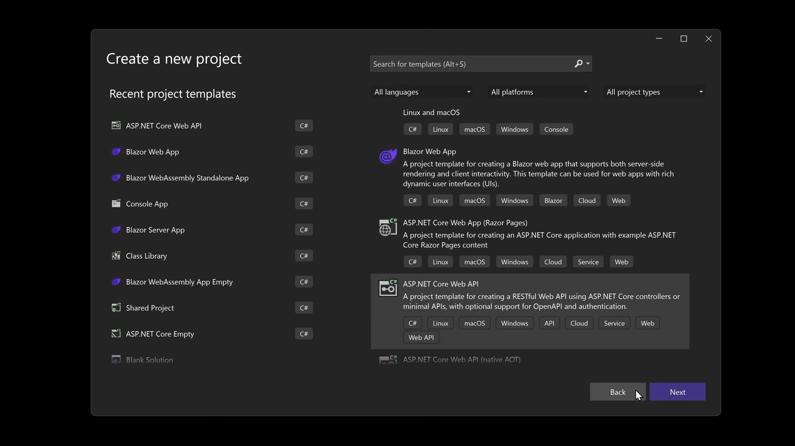
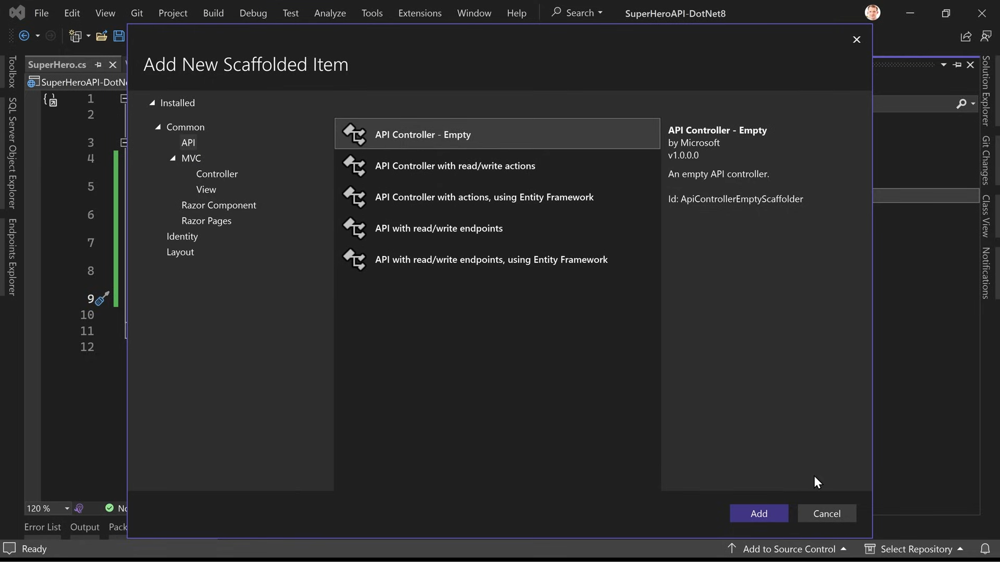
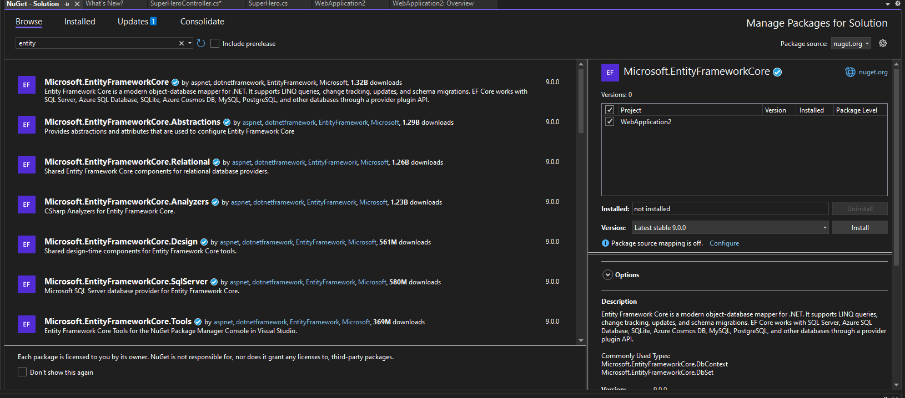
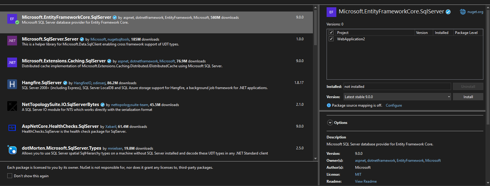
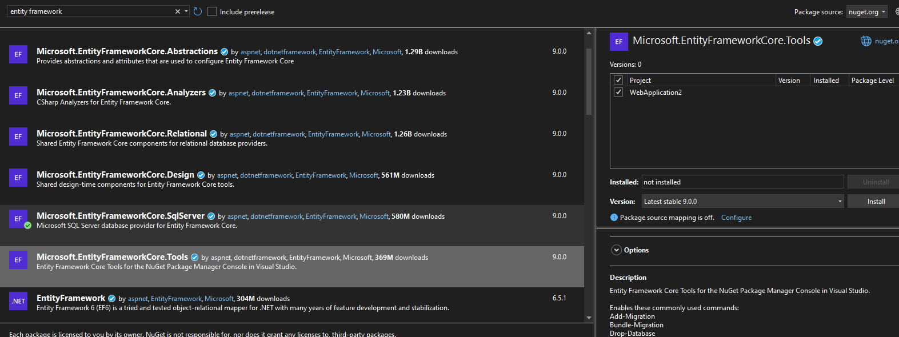

## Learn .NET

1. Create a new ASP.NET Core API project.


2. Add a `Models` directory that contains the data models.

3. Add an API controller for each model.


4. Build the API.

5. Download the Entity Framework.


5. Download the Entity Framework sql server.


6. Download the Entity Framework tools.


### Understanding `async` with User Requests

When building a web API, handling multiple user requests efficiently is critical, especially when some operations (e.g., database queries, external API calls, or file operations) take time to complete. Using asynchronous programming (`async`/`await`) ensures your application can handle many requests simultaneously without blocking threads unnecessarily.

---

### Synchronous Handling of User Requests

When requests are handled synchronously, one thread is dedicated to each request. If one request involves a time-consuming operation (e.g., querying a database), the thread is blocked until the operation finishes. Other incoming requests have to wait until a thread becomes available.

#### Example: Blocking API
```csharp
[HttpGet]
public ActionResult<List<SuperHero>> GetSuperHeroes()
{
    Thread.Sleep(5000); // Simulate a 5-second delay (blocking thread)
    var heroes = new List<SuperHero>
    {
        new SuperHero { Id = "1", Name = "Superman" }
    };
    return Ok(heroes);
}
```

**Scenario**:
- 5 users make requests simultaneously.
- Each request takes 5 seconds to process.
- If the server has only 2 threads:
  - The first 2 requests are processed immediately.
  - The remaining 3 are queued and processed sequentially after a thread becomes free.

**Problem**:
- Other users experience significant delays.
- Server scalability is limited by the number of threads.

---

### Asynchronous Handling of User Requests

With asynchronous handling, the thread is **not blocked** during waiting periods. Instead, the thread is freed to handle other requests. Once the operation (e.g., database query) completes, the response is sent back without tying up a thread.

#### Example: Non-blocking API
```csharp
[HttpGet]
public async Task<ActionResult<List<SuperHero>>> GetSuperHeroes()
{
    await Task.Delay(5000); // Simulate a 5-second delay (non-blocking)
    var heroes = new List<SuperHero>
    {
        new SuperHero { Id = "1", Name = "Superman" }
    };
    return Ok(heroes);
}
```

**Scenario**:
- 5 users make requests simultaneously.
- Each request still takes 5 seconds to process.
- Because threads are not blocked:
  - All 5 requests can be handled concurrently.
  - Each user receives a response after ~5 seconds, without waiting for other requests to finish.

---

### Real-world Example: Fetching Data from a Database

#### Synchronous Database Call
```csharp
[HttpGet]
public ActionResult<List<SuperHero>> GetSuperHeroes()
{
    var heroes = _dbContext.SuperHeroes.ToList(); // Blocking operation
    return Ok(heroes);
}
```
- If querying the database takes 2 seconds, the thread handling this request is blocked for 2 seconds.
- Multiple simultaneous requests may cause delays if all threads are occupied.

---

#### Asynchronous Database Call
```csharp
[HttpGet]
public async Task<ActionResult<List<SuperHero>>> GetSuperHeroes()
{
    var heroes = await _dbContext.SuperHeroes.ToListAsync(); // Non-blocking operation
    return Ok(heroes);
}
```
- While the database query is running, the thread is released to handle other requests.
- Once the query completes, the thread resumes processing the current request.

---

### Comparison of Synchronous vs Asynchronous

| Feature                | Synchronous                             | Asynchronous                             |
|------------------------|------------------------------------------|------------------------------------------|
| **Thread Usage**        | Thread is blocked during long operations | Thread is free during long operations    |
| **Scalability**         | Limited by the number of available threads | Highly scalable due to non-blocking tasks |
| **User Experience**     | Delays for users if threads are busy    | Minimal delays, even with high traffic   |
| **Complexity**          | Simple to implement                    | Requires understanding of `async/await`  |

---

### User Requests Example

#### Scenario
- You are building an API for a movie streaming app.
- Users make requests to:
  1. Fetch a list of available movies (`GET /api/movies`).
  2. Fetch details of a specific movie (`GET /api/movies/{id}`).
  3. Submit a review for a movie (`POST /api/movies/{id}/reviews`).

#### Synchronous Example
```csharp
[HttpGet("movies")]
public ActionResult<List<Movie>> GetMovies()
{
    // Simulate a slow database call
    Thread.Sleep(3000); // Blocking operation
    var movies = _dbContext.Movies.ToList();
    return Ok(movies);
}
```
- If one user makes a request, the thread is blocked for 3 seconds.
- Other users' requests are delayed if all threads are occupied.

---

#### Asynchronous Example
```csharp
[HttpGet("movies")]
public async Task<ActionResult<List<Movie>>> GetMovies()
{
    // Non-blocking database call
    var movies = await _dbContext.Movies.ToListAsync();
    return Ok(movies);
}
```
- Multiple users can fetch movies simultaneously, even if the database query takes time.
- No thread is blocked, so the app can handle more requests concurrently.

---

### Key Benefits for Users
1. **Faster Responses**: Even under heavy load, requests are processed more quickly.
2. **Better Scalability**: The app can handle more users simultaneously.
3. **Improved Availability**: The server remains responsive even during time-consuming operations.

---

### Conclusion
By using `async/await` in web APIs:
- You enable your app to serve more users efficiently.
- You avoid blocking threads on time-consuming operations, improving responsiveness.
- Users experience faster and more reliable service, even during high traffic.

The **`Task`** class is central to working with asynchronous programming in C#. It represents a **unit of work** that will complete in the future. Here's why we need to use `Task` when working with `async`:

---

### **1. Represents an Ongoing or Future Operation**
- A `Task` is like a promise: it represents an operation that is running and may complete in the future.
- When working with `async`, we use `Task` to signal that a method performs its operation asynchronously.

#### **Example**:
```csharp
public async Task<string> GetDataAsync()
{
    await Task.Delay(1000); // Simulate some work
    return "Data fetched";
}
```
- Here, the `Task<string>` indicates that the method will return a `string` value in the future, once the operation completes.

---

### **2. Enables `await` for Asynchronous Execution**
- The `await` keyword can only be used with tasks (`Task` or `Task<T>`). It tells the runtime to:
  - Pause the execution of the method until the task completes.
  - Free the thread for other work in the meantime.

#### **Example**:
```csharp
public async Task ExampleAsync()
{
    Console.WriteLine("Start");
    await Task.Delay(2000); // Pause here, but the thread is not blocked
    Console.WriteLine("End");
}
```
- Without `Task`, the `await` mechanism wouldn't work.

---

### **3. Supports Continuations**
- A `Task` allows you to attach continuations (code that runs after the task completes). This is useful for chaining or handling results/errors.
- Continuations are built into the async/await mechanism.

#### **Example**:
```csharp
Task<int> task = Task.Run(() => 42);
task.ContinueWith(t => Console.WriteLine($"Result: {t.Result}"));
```

---

### **4. Supports Error Handling and Propagation**
- If an exception occurs in an asynchronous method, the `Task` captures it. You can handle it later using `try-catch` or `Task.Exception`.

#### **Example**:
```csharp
public async Task DoWorkAsync()
{
    try
    {
        await Task.Run(() => throw new InvalidOperationException("Error!"));
    }
    catch (Exception ex)
    {
        Console.WriteLine($"Caught exception: {ex.Message}");
    }
}
```

---

### **5. Works Well with Asynchronous APIs**
- Many modern libraries (e.g., Entity Framework, HttpClient) provide asynchronous methods that return `Task` or `Task<T>`.
- To integrate with such APIs, your methods also need to return `Task`.

#### **Example with HttpClient**:
```csharp
public async Task<string> FetchDataAsync()
{
    using var client = new HttpClient();
    string data = await client.GetStringAsync("https://example.com");
    return data;
}
```

---

### **6. Enables Parallelism**
- With `Task.WhenAll` or `Task.WhenAny`, you can run multiple tasks in parallel and wait for their completion.

#### **Example**:
```csharp
public async Task FetchMultipleAsync()
{
    var task1 = Task.Delay(2000);
    var task2 = Task.Delay(3000);

    await Task.WhenAll(task1, task2); // Both tasks run concurrently
    Console.WriteLine("All tasks completed");
}
```

---

### **Summary**
- `Task` is essential when working with `async` in C# because it:
  - Represents an asynchronous operation.
  - Enables `await` for non-blocking execution.
  - Allows chaining, error handling, and combining multiple operations.
  - Integrates seamlessly with modern APIs and libraries.

Without `Task`, asynchronous programming would lack structure, making it harder to manage and coordinate operations effectively.


### Setting Up the Database

1. **Install Entity Framework Core**:
   - Open the terminal in your project directory.
   - Run the following command to install the necessary packages:
     ```sh
     dotnet add package Microsoft.EntityFrameworkCore
     dotnet add package Microsoft.EntityFrameworkCore.SqlServer
     dotnet add package Microsoft.EntityFrameworkCore.Tools
     ```

2. **Create the Data Context**:
   - Add a new class called `AppDbContext` in a `Data` directory:
     ```csharp
     // filepath: /C:/vs code/GitHub/learn/WEB DEV/BACK-END/.Net-STACK/Data/AppDbContext.cs
     using Microsoft.EntityFrameworkCore;

     public class AppDbContext : DbContext
     {
         public AppDbContext(DbContextOptions<AppDbContext> options) : base(options) { }

         public DbSet<YourModel> YourModels { get; set; }
     }
     ```

3. **Configure the Connection String**:
   - Add the connection string to your `appsettings.json` file:
     ```json
     // filepath: /C:/vs code/GitHub/learn/WEB DEV/BACK-END/.Net-STACK/appsettings.json
     {
       "ConnectionStrings": {
         "DefaultConnection": "Server=your_server;Database=your_database;User Id=your_user;Password=your_password;"
       }
     }
     ```
### **Verify Authentication Mode**
- **SQL Server Authentication**: Use `User Id=your_user;Password=your_password;`.
- **Windows Authentication**: Use `Trusted_Connection=True;`.

Example:
- **SQL Server Authentication**:
  ```json
  "Server=your_server;Database=your_database;User Id=your_user;Password=your_password;Trusted_Connection=True;TrustServerCertificate=True;"
  ```
- **Windows Authentication**:
  ```json
  "Server=your_server;Database=your_database;Trusted_Connection=True;TrustServerCertificate=True;"
  ```

---
#### **. Trust Server Certificate**
The option `TrustServerCertificate=True` is used to bypass SSL certificate validation. Ensure this is necessary for your setup. If your server requires encryption, configure the SSL certificates properly.

---
#### **. Trusted Connection**
The option `Trusted_Connection=True` is used in a SQL Server connection string, it indicates that the connection will use **Windows Authentication** rather than SQL Server Authentication.

---


4. **Register the Data Context**:
   - Update the `Startup.cs` or `Program.cs` file to register the `AppDbContext`:
     ```csharp
     // filepath: /C:/vs code/GitHub/learn/WEB DEV/BACK-END/.Net-STACK/Startup.cs
     public void ConfigureServices(IServiceCollection services)
     {
         services.AddDbContext<AppDbContext>(options =>
             options.UseSqlServer(Configuration.GetConnectionString("DefaultConnection")));
         ...
     }
     ```

5. **Create and Apply Migrations**:
   - Run the following commands to create and apply migrations:
     ```sh
     add-Migration Initial
     database update
     ```

## Stop video  32:00
[stop video](https://youtu.be/b8fFRX0T38M?si=UiObG2FMoezPwIIb)