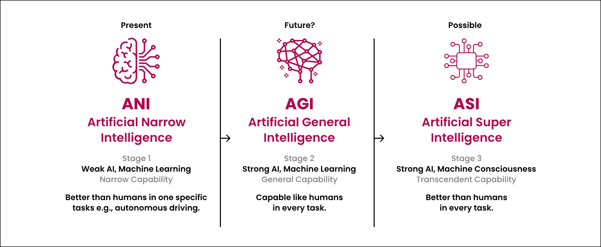
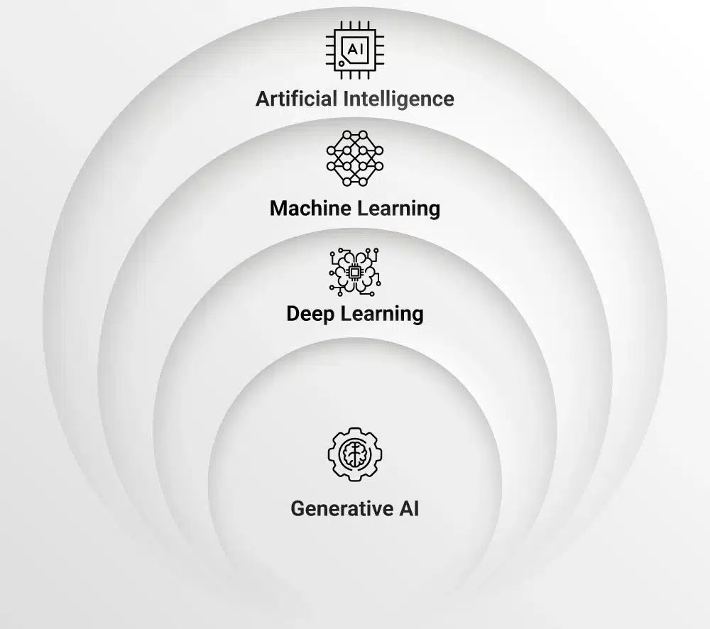

# 🎓 Supervised Machine Learning – Regression & Classification

### *Based on the course by Andrew Ng | Stanford University | via Coursera (Free to audit)*

---

## 🧾 Cover Page (Optional in PDF Export)

**Title:** Supervised Machine Learning – Regression & Classification
**Author:** Ayoub majjid
**Institution:** EMSI
**Date:** *July 2025*
**Course Instructor:** Andrew Ng
**Platform:** Coursera (by DeepLearning.AI & Stanford University)

---

## 📘 Course Overview

This course introduces the **core concepts of supervised learning**, with a focus on **regression** and **classification**. It is part of the *Machine Learning Specialization* and taught by **Andrew Ng**, one of the most influential figures in AI education.

---

## 🔍 What You’ll Learn

### 1. Supervised Learning Fundamentals

* What supervised learning is
* The difference between **regression** and **classification** tasks
* Real-world applications for each

### 2. Core Machine Learning Algorithms

* Linear Regression
* Logistic Regression
* Gradient Descent
* Multivariate Regression

### 3. Model Performance & Evaluation

* Loss functions: **MSE**, **Log Loss**
* Metrics: **Accuracy**, **Precision**, **Recall**, **F1 Score**
* Bias–variance tradeoff
* Avoiding **overfitting** and **underfitting**

### 4. Practical Tools & Techniques

* Training, validation, and test sets
* Feature scaling & normalization
* Polynomial regression
* Decision boundaries (intro)

---

## 🧠 Why This Course Matters

Understanding supervised learning is **fundamental to building real-world AI systems**. Whether you're working on email spam detection, sales forecasting, or recommendation engines — these are the building blocks of applied machine learning.

---

## 🛠️ Technologies / Tools Used

* Python (examples provided in code cells)
* Jupyter Notebooks (for hands-on practice)
* Assignments to reinforce each concept

---

## 👤 Who Is This Course For?

* Beginners in Machine Learning
* Software developers entering the AI space
* Data analysts and engineers seeking to upskill

---

## 🔗 Course Link

👉 [Supervised Machine Learning: Regression and Classification – Coursera](https://www.coursera.org/learn/machine-learning)

---

# 🤖 Introduction to Artificial Intelligence

**Artificial Intelligence (AI)** is the science of building systems that simulate human intelligence — like reasoning, learning, and decision-making.

---

## Ai Stages :

### 🔹 **AGI (Artificial General Intelligence)**

A future goal: machines with **human-level intelligence**, able to learn and adapt across any task.
**Status:** Not yet achieved.

## 🧠 Ai subsets (layers) :

### 🔹 **AI (Artificial Intelligence)**

The broadest field — includes any system that mimics human thinking (rules or data-driven).
**Examples:** Virtual assistants, self-driving tech.

### 🔹 **ML (Machine Learning)**

A subset of AI — systems that **learn from data** to predict or decide.
**Examples:** Spam filters, recommendations.

### 🔹 **DL (Deep Learning)**

A subset of ML — uses **neural networks** for complex tasks like image or speech recognition.
**Examples:** Face ID, language translation.

### 🔹 **Generative AI**

A branch of DL — creates new content like **text, images, or code**.
**Examples:** ChatGPT, DALL·E, GitHub Copilot.

---

## 📊 Summary Table

| Term  | Type          | What it Does                | Example                  |
| ----- | ------------- | --------------------------- | ------------------------ |
| AI    | Broad concept | Simulates intelligence      | Siri, automation         |
| AGI   | Future goal   | Learns & thinks like humans | Still under research     |
| ML    | Subset of AI  | Learns from data            | Fraud detection          |
| DL    | Subset of ML  | Uses neural networks        | Image/speech recognition |
| GenAI | Subset of DL  | Generates content           | ChatGPT, DALL·E         |

---

# 
