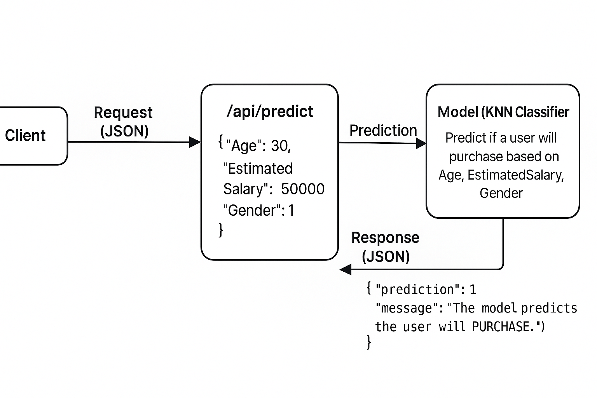

# KNN Classifier API Documentation

## Base URL

```
http://<server-host>:5000/api
```

All endpoints are prefixed with `/api` because the Flask app uses a  **Blueprint** .

---

## Endpoints Overview

| Endpoint     | Method | Description                                     |
| ------------ | ------ | ----------------------------------------------- |
| `/health`  | GET    | Check if the API is running and model is loaded |
| `/info`    | GET    | Provides model information and features         |
| `/predict` | POST   | Predict whether a user will purchase            |

---

## 1️⃣ Health Check

* **URL:** `/api/health`
* **Method:** `GET`
* **Description:** Returns the status of the API and confirms the model is loaded.

**Response Example:**

```json
{
  "status": "UP",
  "model_loaded": true
}
```

---

## 2️⃣ Info Endpoint

* **URL:** `/api/info`
* **Method:** `GET`
* **Description:** Provides information about the model, including features and purpose.

**Response Example:**

```json
{
  "model": "KNN Classifier",
  "description": "Predict if a user will purchase based on Age, EstimatedSalary, Gender",
  "features": ["Age", "EstimatedSalary", "Gender"]
}
```

---

## 3️⃣ Predict Endpoint



* **URL:** `/api/predict`
* **Method:** `POST`
* **Description:** Predicts whether a user will purchase a product using the KNN model.

**Request Format:**

```json
{
  "Age": <integer>,
  "EstimatedSalary": <integer>,
  "Gender": <0 or 1>
}
```

* **Age:** User's age (integer)
* **EstimatedSalary:** Estimated salary of the user (integer)
* **Gender:** Gender of the user (`0` = Female, `1` = Male)

**Example Request:**

```json
{
  "Age": 30,
  "EstimatedSalary": 50000,
  "Gender": 1
}
```

**Response Format:**

```json
{
  "prediction": <0 or 1>,
  "message": "<Friendly message>"
}
```

**Example Response:**

```json
{
  "prediction": 1,
  "message": "The model predicts the user will PURCHASE."
}
```

**Error Response Example (missing input):**

```json
{
  "error": "No input data provided"
}
```

**Error Response Example (invalid input):**

```json
{
  "error": "could not convert string to float: 'abc'"
}
```

---

## Usage Example (Python)

```python
import requests

url = "http://127.0.0.1:5000/api/predict"
data = {
    "Age": 30,
    "EstimatedSalary": 50000,
    "Gender": 1
}

response = requests.post(url, json=data)
print(response.json())
```

**Expected Output:**

```json
{
  "prediction": 1,
  "message": "The model predicts the user will PURCHASE."
}
```

---

## Notes

* The API uses a **pre-trained KNN model** saved as `models/knn_model.pkl`.
* Predictions are scaled using a  **StandardScaler** .
* Make sure all fields in the request are numeric and valid.
* The API is structured using **Flask Blueprints** for modularity and future expansion.
