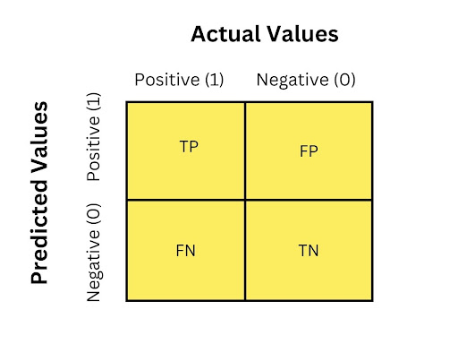

# Confusion Matrix Documentation 

## Overview

This project implements a **K-Nearest Neighbors (KNN)** classifier to predict whether a user will purchase a product based on the features:

* **Age**
* **EstimatedSalary**
* **Gender** (encoded as 0 = Female, 1 = Male)

The model was trained on the `Social_Network_Ads.csv` dataset and evaluated using a test set. The trained model is saved as `models/knn_model.pkl` for reuse in predictions.

---

## Confusion Matrix

The confusion matrix for the test set:



```
[[64  4]
 [ 3 29]]
```

### Structure

For a **binary classification problem** (`Purchased = 1`, `Not Purchased = 0`):

|              | **Predicted 0**     | **Predicted 1**     |
| ------------ | ------------------- | ------------------- |
| **Actual 0** | True Negative (TN)  | False Positive (FP) |
| **Actual 1** | False Negative (FN) | True Positive (TP)  |

* **TN = 64** → Correctly predicted 64 users **did NOT purchase**.
* **FP = 4** → Predicted purchase incorrectly for 4 non-purchasers.
* **FN = 3** → Missed 3 actual purchasers.
* **TP = 29** → Correctly predicted 29 users **did purchase**.

---

## Key Metrics

1. **Accuracy**:

[
\text{Accuracy} = \frac{TP + TN}{TP + TN + FP + FN} = \frac{29 + 64}{29 + 64 + 4 + 3} = 0.93
]

* The model correctly predicts **93%** of cases.

2. **Precision (Purchased = 1)**:

[
\text{Precision} = \frac{TP}{TP + FP} = \frac{29}{29 + 4} \approx 0.879
]

* ~88% of predicted purchasers are correct.

3. **Recall (Purchased = 1)**:

[
\text{Recall} = \frac{TP}{TP + FN} = \frac{29}{29 + 3} \approx 0.906
]

* ~91% of actual purchasers are correctly identified.

4. **F1-score**:

[
F1 = 2 * \frac{\text{Precision} * \text{Recall}}{\text{Precision} + \text{Recall}} \approx 0.892
]

* A balanced measure of precision and recall.

---

## Interpretation

* The model demonstrates **excellent performance** with high accuracy, precision, and recall.

* Misclassifications are minimal:

  * **4 false positives**: non-purchasers predicted as purchasers.
  * **3 false negatives**: purchasers predicted as non-purchasers.

* High recall indicates the model is effective at detecting buyers.

* High precision indicates the predictions of purchase are reliable.

---

## Usage

* The trained model can be loaded using `pickle`:

```python
import pickle

with open('models/knn_model.pkl', 'rb') as file:
    model = pickle.load(file)
```

* Predict for new users:

```python
import numpy as np

X_new = np.array([[30, 50000, 1]])  # Age, EstimatedSalary, Gender
prediction = model.predict(X_new)
print("Purchase" if prediction[0] == 1 else "Not Purchase")
```
