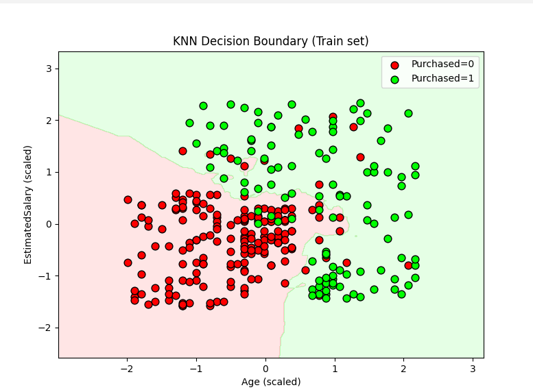
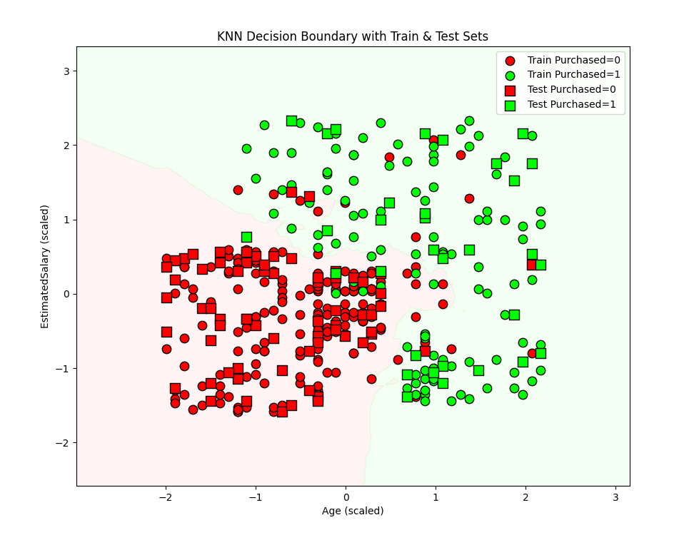

# KNN Decision Boundary Visualization Documentation

## Overview

This document explains how to visualize the **decision boundary** of a K-Nearest Neighbors (KNN) classifier and interpret the plots. Visualization helps to:

* Understand the  **model’s behavior** .
* Detect **clusters** in feature space.
* Identify  **misclassifications** .
* Compare  **train vs test performance visually** .

The classifier uses:

* **Age**
* **EstimatedSalary**
* **Gender** (encoded 0 = Female, 1 = Male)

Since we are plotting in 2D, **Gender is fixed at 0** for visualization purposes.

---

## 1️⃣ Decision Boundary: Single Dataset

### Function: `plot_decision_boundary`



```python
def plot_decision_boundary(model, X, y, feature_indices=[0,1], title="KNN Decision Boundary"):
    """
    Visualize KNN decision boundary for 2 features.
  
    Parameters:
        model : trained KNN model
        X : feature matrix (scaled)
        y : labels
        feature_indices : list of 2 feature indices to plot (default [0,1] → Age & EstimatedSalary)
    """
```

**Explanation:**

* `X` → Feature matrix (scaled)
* `y` → Labels (0 = Not Purchased, 1 = Purchased)
* `feature_indices` → Pick which two features to plot (default Age & EstimatedSalary)
* `model` → Pre-trained KNN classifier

---

```python
X_plot = X[:, feature_indices]
```

* Extracts only the two features chosen for plotting.
* Example: `X[:, [0,1]]` → Age and EstimatedSalary.

---

```python
x_min, x_max = X_plot[:,0].min() - 1, X_plot[:,0].max() + 1
y_min, y_max = X_plot[:,1].min() - 1, X_plot[:,1].max() + 1
xx, yy = np.meshgrid(np.arange(x_min, x_max, 0.01),
                     np.arange(y_min, y_max, 0.01))
```

* **Meshgrid** : generates a grid of points covering the feature space.
* `np.arange(..., 0.01)` → creates fine resolution for smooth decision boundary.
* `x_min/x_max`, `y_min/y_max` → slightly extend the plot limits for better visualization.

---

```python
Z = model.predict(np.c_[xx.ravel(), yy.ravel(), np.zeros_like(xx.ravel())])
Z = Z.reshape(xx.shape)
```

* Predict the class for every point on the grid.
* `np.c_[]` → concatenate meshgrid points into proper input format for KNN.
* **Important:** Gender = 0 (fixed) because we can only plot 2 features.
* `reshape(xx.shape)` → reshape predictions to match the meshgrid shape for plotting.

---

```python
cmap_light = ListedColormap(['#FFAAAA', '#AAFFAA'])
cmap_bold = ListedColormap(['#FF0000', '#00FF00'])
```

* `cmap_light` → background colors (decision regions).
* `cmap_bold` → actual points (training data) colors.

---

```python
plt.figure(figsize=(8,6))
plt.contourf(xx, yy, Z, alpha=0.3, cmap=cmap_light)
```

* Plot **decision regions** as filled contours with some transparency (`alpha=0.3`).

---

```python
for label in np.unique(y):
    plt.scatter(X_plot[y==label, 0], X_plot[y==label, 1],
                c=[cmap_bold(label)], label=f"Purchased={label}", edgecolor='k', s=60)
```

* Plot  **actual points** :
  * Red → Purchased = 0
  * Green → Purchased = 1
* `edgecolor='k'` → black edge for better visibility.

---

```python
plt.xlabel("Age (scaled)")
plt.ylabel("EstimatedSalary (scaled)")
plt.title(title)
plt.legend()
plt.show()
```

* Add  **labels** ,  **title** , and  **legend** .
* `plt.show()` → display the plot.

---

### Insights

* Correct points are in matching colored regions.
* Misclassifications appear in opposite regions.
* Provides intuition about **clusters** and  **boundary shape** .

---

## 2️⃣ Decision Boundary: Train + Test Sets

### Function: `plot_decision_boundary_train_test`


```python
def plot_decision_boundary_train_test(model, X_train, y_train, X_test, y_test, feature_indices=[0,1]):
    """
    Visualize KNN decision boundary for 2 features with both training and test sets.
    """
```

**Explanation:**

* Same as single dataset, but we also include **test points** to assess generalization.

---

```python
X_plot = np.vstack([X_train[:, feature_indices], X_test[:, feature_indices]])
x_min, x_max = X_plot[:,0].min() - 1, X_plot[:,0].max() + 1
y_min, y_max = X_plot[:,1].min() - 1, X_plot[:,1].max() + 1
xx, yy = np.meshgrid(np.arange(x_min, x_max, 0.01),
                     np.arange(y_min, y_max, 0.01))
```

* Combine train and test to **determine grid limits** that cover all data points.

---

```python
Z = model.predict(np.c_[xx.ravel(), yy.ravel(), np.zeros_like(xx.ravel())])
Z = Z.reshape(xx.shape)
```

* Predict grid points (fix Gender = 0).

---

```python
cmap_light = ListedColormap(['#FFDDDD', '#DDFFDD'])
cmap_bold = ListedColormap(['#FF0000', '#00FF00'])
plt.figure(figsize=(10,8))
plt.contourf(xx, yy, Z, alpha=0.3, cmap=cmap_light)
```

* Light colors for decision regions.
* Slightly bigger figure for clarity.

---

```python
# Training points
for label in np.unique(y_train):
    plt.scatter(X_train[y_train==label, feature_indices[0]], 
                X_train[y_train==label, feature_indices[1]],
                c=[cmap_bold(label)], marker='o', edgecolor='k', s=80,
                label=f"Train Purchased={label}")
```

* **Circles (`o`)** → training points.

---

```python
# Test points
for label in np.unique(y_test):
    plt.scatter(X_test[y_test==label, feature_indices[0]], 
                X_test[y_test==label, feature_indices[1]],
                c=[cmap_bold(label)], marker='s', edgecolor='k', s=100,
                label=f"Test Purchased={label}")
```

* **Squares (`s`)** → test points.
* Easily distinguish training vs test data.

---

```python
plt.xlabel("Age (scaled)")
plt.ylabel("EstimatedSalary (scaled)")
plt.title("KNN Decision Boundary with Train & Test Sets")
plt.legend()
plt.show()
```

* Labels, title, legend, and display.
* Misclassified test points are easily visible, giving insight into  **generalization performance** .

---

## 3️⃣ Using Visualization in Main Pipeline

```python
from visualize import plot_decision_boundary_train_test

# After training and evaluating KNN:
plot_decision_boundary_train_test(model, X_train, y_train, X_test, y_test)
```

