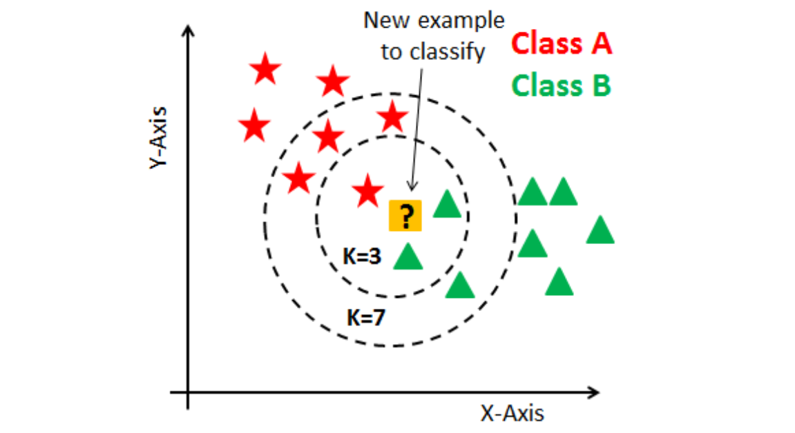
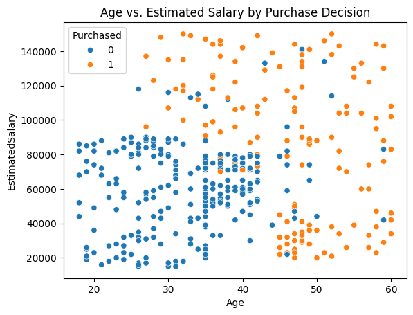
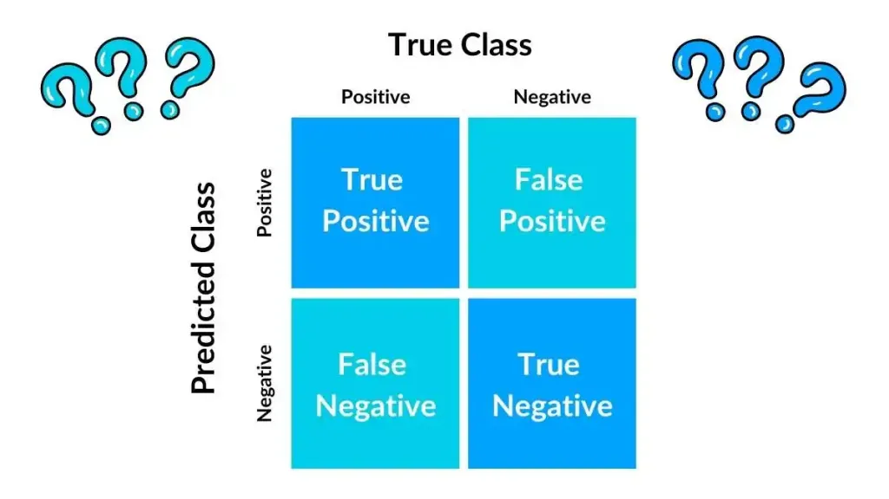

## 🧠 K-Nearest Neighbors (KNN) Classification Project

**Author:** Ayoub Majjid

**Email:** [ayoub@majjid.com](mailto:ayoub@majjid.com)

**Portfolio:** [majjid.com](https://majjid.com)

**Repository:** [https://github.com/ayoubmajid67/learn.git](https://github.com/ayoubmajid67/learn.git)

---

### 🎯 **Project Goal**

This project predicts **whether a user will purchase a product** based on demographic data such as:

***Age**

***Estimated Salary**

***Gender**

We use the **K-Nearest Neighbors (KNN)** algorithm — a simple but powerful **machine learning model** that classifies a new point based on its **closest neighbors** in the training data.

---

### 🏗️ **Notebook Outline**

This notebook demonstrates how to:

1. Load and explore data
2. Preprocess data for ML models
3. Train the KNN classifier
4. Evaluate model performance
5. Visualize decision boundaries
6. Interpret the results visually and statistically

---

## 🧩 Step 0: Understanding the Idea Behind the KNN Algorithm

Before we start coding, let’s understand **what KNN is and how it works.**

---

### 🧠 **What is KNN?**

**K-Nearest Neighbors (KNN)** is one of the simplest **supervised machine learning algorithms** used for **classification** and **regression**.

* “Supervised” means it **learns from labeled examples** — data where we already know the correct answer (for example, whether a user bought a product or not).
* KNN doesn’t build an equation or internal model. Instead, it **stores all training examples** and classifies new data by **comparing** it to those examples.

It’s often described as **“learning by analogy.”**

---

### 📏 **How It Works – Step by Step**

Imagine you have a dataset of users with:

* Age
* Estimated Salary
* Whether they purchased a product (Yes/No)

Now, suppose we meet a **new user** and want to predict if they will buy the product.

Here’s what KNN does:


1️⃣ **Compute Distances:**


1️⃣ **Compute Distances:**

* Measure how “close” the new user is to every user in the training set.
* The most common distance metric is the **Euclidean distance**:

[

d = \sqrt{(x_1 - x_2)^2 + (y_1 - y_2)^2 + ...}

]

This tells us how far points are in multi-dimensional space.

---

2️⃣ **Find the K Nearest Neighbors:**

* Sort all training samples by distance from the new user.
* Pick the **K closest ones** (for example, the 5 nearest points).

---

3️⃣ **Voting:**



* Each neighbor “votes” for its class (Purchased = 1, Not Purchased = 0).
* The class with the **most votes** becomes the prediction.

Example:

```

K = 5 → [1, 0, 1, 1, 0]

Votes → Purchased = 3, Not Purchased = 2 → Predict Purchased (1)

```

---

### ⚙️ **Choosing the Right Value of K**

***Small K** → very sensitive to noise (too local, may overfit).

***Large K** → smoother, but may ignore local patterns (underfit).

* Typically, we test several values of K and pick the one with the best validation accuracy.

---

### 🎯 **Why Does KNN Work Well?**

KNN works best when:

* The **data has clear clusters or groups**, like “buyers” and “non-buyers.”
* The **features are scaled**, so no feature dominates distance calculation.
* The **relationship between inputs and output is non-linear** — KNN doesn’t assume any mathematical formula, it adapts to the data shape.

In our case:

* Users with **similar ages and incomes** tend to behave similarly.
* So KNN can easily find patterns based on proximity in feature space.

---

### 🧩 **KNN in One Sentence:**

> “To predict something new, look at your closest examples and do what most of them do.”

---

Now that you understand the concept, let’s move on to **data loading and preprocessing** so we can apply this algorithm in practice.

---

## 🏗️ Step 0.5: Understanding the Project Structure

```

KNN_Project/

│

├── data/

│   └── Social_Network_Ads.csv          # Dataset used for training and testing

│

├── docs/                               # Documentation files

│   ├── api_documentation.pdf           # API documentation (PDF)

│   ├── project_overview.md             # General project explanation

│   └── KNN_SIG_MODEL.postman_collection.json  # Postman collection for testing API

│

├── models/

│   └── knn_model.pkl                    # Saved trained KNN model for reuse

│

├── notebooks/

│   └── knn_classification.ipynb        # Main Jupyter Notebook

│

├── src/                                # Source code directory containing reusable modules

│   ├── __init__.py                      # Marks src as a Python package

│   ├── data_loader.py                   # Loads and returns the dataset

│   ├── preprocessing.py                 # Encodes, scales, and splits the data

│   ├── model_train.py                   # Trains and saves the KNN model

│   ├── evaluate.py                      # Evaluates the model (accuracy, confusion matrix)

│   └── visualize.py                     # Plots decision boundaries and data distributions

│

├── api/                                # Flask API application

│   ├── __init__.py                      # Initialize the Flask app

│   └── routes/                          # Endpoints of the API

│       └── api_bp.py                    # Blueprint with all endpoints

│

├── main_train.py                        # Script to train the model outside notebook

├── main.py                              # Start the Flask API server

├── requirements.txt                     # Dependencies list (e.g., pandas, sklearn, flask)

└── README.md                             # Project overview, usage instructions, setup guide

```

### 🔍 Explanation of Each Component

-**data/** → Stores all raw or processed datasets used by the model.

-**models/** → Keeps trained model files so they can be reused in APIs or other applications.

-**src/** → Contains all modularized Python scripts for each process: loading, preprocessing, training, evaluation, and visualization.

-**notebooks/** → Interactive notebooks used for experimentation and documentation.

-**requirements.txt** → Lists all Python dependencies to replicate the environment easily.

---

This modular design follows the principle of **separation of concerns**, ensuring that each part of the system has a single responsibility.

## **Step-by-Step Guide to Run the Project (Using `venv`)**

1.**Clone the repository**:

```bash

gitclonehttps://github.com/ayoubmajid67/learn.git

cdprojects/KNN_Project

```

2.**Create a virtual environment**:

```bash

python-mvenvvenv

```

3.**Activate the virtual environment**:

***Windows (cmd):**

```cmd

venv\Scripts\activate

```

***Windows (PowerShell):**

```powershell

venv\Scripts\Activate.ps1

```

***Linux / MacOS:**

```bash

sourcevenv/bin/activate

```

4.**Install dependencies**:

```bash

pipinstall-rrequirements.txt

```

5.**Train the model (optional if not already trained)**:

```bash

pythonmain_train.py

```

* Reads the dataset, preprocesses it, trains the KNN model, and saves it to `models/knn_model.pkl`.

6.**Start the Flask API server**:

```bash

pythonmain.py

```

* The API will run at `http://127.0.0.1:5000`.

7.**Test the API**:

***Check API documentation**: Open `docs/api_documentation.pdf`.

***Postman testing**: Import `docs/KNN_SIG_MODEL.postman_collection.json` into Postman and run the endpoints directly.


* Example request :


---

✅ **Tips / Notes**

* Keep your virtual environment **activated** whenever you work on the project.
* Store **all new documentation or API updates** in the `docs/` folder.
* The **Postman collection** is a ready-to-use way to test all endpoints without writing additional code.

---

## ⚙️ Step 1: Import Dependencies and Setup

We’ll import the modules from our `/src` package to keep our project modular and clean.

```python

import sys

import os


# Optional: run once to include project root in sys.path

"""

project_root = os.path.abspath(os.path.join(os.getcwd(), '..'))

if project_root not in sys.path:

    sys.path.append(project_root)

"""


from src.model_train import train_knn, save_model

from src.evaluate import evaluate_model

from src.data_loader import load_data

from src.preprocessing import preprocess_data

from src.visualize import plot_decision_boundary_train_test


import pandas as pd

import matplotlib.pyplot as plt

import seaborn as sns

```

---

## 📊 Step 2: Load and Explore the Dataset

We start by loading our dataset — **Social_Network_Ads.csv**, which contains information about users and whether they purchased a product after seeing an ad.

```python

defload_data(path='data/Social_Network_Ads.csv'):

    return pd.read_csv(path)


df = load_data("../data/Social_Network_Ads.csv")

df.head()

df.info()

```

### 🔍 **Observations**

***Features:** Age, Gender, EstimatedSalary

***Target:** Purchased (1 = yes, 0 = no)

* We will later convert categorical values like “Male/Female” into numeric codes.

---

## 🧩 Step 3: Data Preprocessing

Machine Learning models can’t understand text or unscaled values — they work best with **numerical, normalized data**.

```python

from sklearn.model_selection import train_test_split

from sklearn.preprocessing import LabelEncoder, StandardScaler


defpreprocess_data(df):

    # Encode gender (text → numeric)

    df['Gender'] = LabelEncoder().fit_transform(df['Gender'].astype(str))


    # Split into features and target

    X = df[['Age', 'EstimatedSalary', 'Gender']].values

    y = df['Purchased'].values


    # Train-test split (75% training, 25% testing)

    X_train, X_test, y_train, y_test = train_test_split(X, y, test_size=0.25, random_state=0)


    # Scale features for KNN (important!)

    sc = StandardScaler()

    X_train = sc.fit_transform(X_train)

    X_test = sc.transform(X_test)


    return X_train, X_test, y_train, y_test


X_train, X_test, y_train, y_test = preprocess_data(df)

print(f"Training set: {X_train.shape}, Test set: {X_test.shape}")

```

### 💡 Why Scaling?

KNN uses **distance** to decide neighbors.

Without scaling, a feature like *salary* (which can be in thousands) would dominate over *age*.

---

## 📈 Step 4: Visualize the Data

Before training, let’s visualize how Age and Estimated Salary relate to purchasing decisions.

```python

sns.scatterplot(data=df, x='Age', y='EstimatedSalary', hue='Purchased', palette='coolwarm')

plt.title("Age vs. Estimated Salary by Purchase Decision")

plt.show()

```



### 🧠 **Interpretation:**

* Clusters form naturally: younger users with lower income rarely purchase.
* Older or higher-salary users are more likely to purchase.
* This gives intuition for why KNN (a distance-based algorithm) works well here.

---

## 🧠 Step 5: Train the KNN Model

KNN works by looking at the **K nearest neighbors** of a point and letting them “vote” on its class.

```python

model = train_knn(X_train, y_train)

```

### 💬 Example:

If ( K = 5 ) and among the 5 nearest users, 3 purchased and 2 did not → the model predicts **Purchased = 1**.

---

## 💾 Step 6: Save the Trained Model

We save the trained KNN model using Python’s `pickle` for reuse in APIs or apps.

```python

save_model(model, '../models/knn_model.pkl')

```

---

## 🧪 Step 7: Evaluate the Model



We test our model on unseen data and calculate performance metrics.

```python

acc, cm = evaluate_model(model, X_test, y_test)

print(f"Accuracy: {acc:.2f}")

print("Confusion Matrix:\n", cm)


sns.heatmap(cm, annot=True, fmt='d', cmap='Blues')

plt.title("Confusion Matrix Heatmap")

plt.xlabel("Predicted")

plt.ylabel("Actual")

plt.show()

```


### 📊 **Interpreting the Confusion Matrix**

From your documentation:

```

[[64  4]

 [ 3 29]]

```

| Term                    | Meaning                        | Count |

| ----------------------- | ------------------------------ | ----- |

| **TN (True Negative)**  | Correctly predicted non-buyers | 64    |

| **FP (False Positive)** | Incorrectly predicted buyers   | 4     |

| **FN (False Negative)** | Missed actual buyers           | 3     |

| **TP (True Positive)**  | Correctly predicted buyers     | 29    |

**Accuracy:** 93%

**Precision:** 88%

**Recall:** 91%

**F1-Score:** 89%

✅ The model performs well — minimal misclassifications, strong generalization.

---

## 🎨 Step 8: Visualize Decision Boundaries

Now, let’s see **how the model makes its decisions visually**.

```python

plot_decision_boundary_train_test(model, X_train, y_train, X_test, y_test)

```

### 🧭 **How It Works (from your visualization doc):**

1.**Meshgrid Creation** – a grid of possible (Age, Salary) pairs is generated.

2.**Model Prediction** – KNN predicts each point as “buy” or “not buy.”

3.**Color Regions:**

* 🟥 **Red:** Model predicts “Not Purchased (0)”
* 🟩 **Green:** Model predicts “Purchased (1)”

4.**Data Points:**

* Circles → Training set
* Squares → Test set


### 🧠 **Graph Insights**

* Green and red zones show **decision boundaries** created by KNN.
* Overlapping regions represent **uncertain areas**.
* Misclassified points appear in the “wrong” color zone.
* The model captures complex shapes — a major strength of KNN.

---

## ✅ Step 9: Conclusion

***KNN** effectively distinguishes buyers from non-buyers based on demographic data.

***Accuracy:** 93% with balanced precision and recall.

***Visualization** reveals how KNN adapts to nonlinear patterns.

***Model saved** as `models/knn_model.pkl` for reuse.

---

## 🌐 Author Information

**👨‍💻 Author:** Ayoub Majjid

**📧 Email:** [ayoub@majjid.com](mailto:ayoub@majjid.com)

**🌍 Portfolio:** [majjid.com](https://majjid.com)

**📂 Repository:  [https://github.com/ayoubmajid67/learn.git](https://github.com/ayoubmajid67/learn.git)
