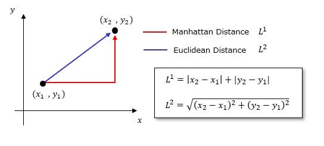
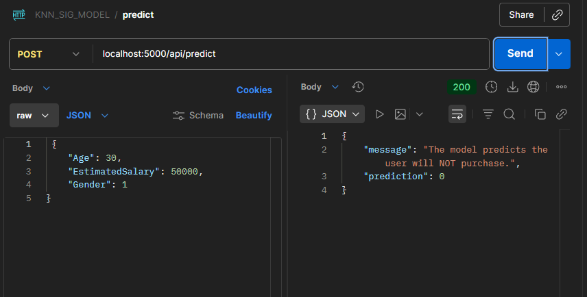

## 🧠 K-Nearest Neighbors (KNN) Classification Project

**Author:** Ayoub Majjid

**Email:** [ayoub@majjid.com](mailto:ayoub@majjid.com)

**Portfolio:** [majjid.com](https://majjid.com)

**📂 Repository:** **Repository:** [https://github.com/ayoubmajid67/learn/tree/main/ai_data/projects/KNN_Project](https://github.com/ayoubmajid67/learn/tree/main/ai_data/projects/KNN_Project)

---

### 🎯 **Project Goal**

This project predicts **whether a user will purchase a product** based on demographic data such as:

***Age**

***Estimated Salary**

***Gender**

We use the **K-Nearest Neighbors (KNN)** algorithm — a simple but powerful **machine learning model** that classifies a new point based on its **closest neighbors** in the training data.

---

### 🏗️ **Notebook Outline**

This notebook demonstrates how to:

1. Load and explore data
2. Preprocess data for ML models
3. Train the KNN classifier
4. Evaluate model performance
5. Visualize decision boundaries
6. Interpret the results visually and statistically

---

## 🧩 Step 0: Understanding the Idea Behind the KNN Algorithm

Before we start coding, let’s understand **what KNN is and how it works.**

---

### 🧠 **What is KNN?**

**K-Nearest Neighbors (KNN)** is one of the simplest **supervised machine learning algorithms** used for **classification** and **regression**.

* “Supervised” means it **learns from labeled examples** — data where we already know the correct answer (for example, whether a user bought a product or not).
* KNN doesn’t build an equation or internal model. Instead, it **stores all training examples** and classifies new data by **comparing** it to those examples.

It’s often described as **“learning by analogy.”**

---

### 📏 **How It Works – Step by Step**

Imagine you have a dataset of users with:

* Age
* Estimated Salary
* Whether they purchased a product (Yes/No)

Now, suppose we meet a **new user** and want to predict if they will buy the product.

Here’s what KNN does:


1️⃣ **Compute Distances:**



1️⃣ **Compute Distances:**

* Measure how “close” the new user is to every user in the training set.
* The most common distance metric is the **Euclidean distance**:

[

d = \sqrt{(x_1 - x_2)^2 + (y_1 - y_2)^2 + ...}

]

This tells us how far points are in multi-dimensional space.

---

2️⃣ **Find the K Nearest Neighbors:**

* Sort all training samples by distance from the new user.
* Pick the **K closest ones** (for example, the 5 nearest points).

---

3️⃣ **Voting:**


* Each neighbor “votes” for its class (Purchased = 1, Not Purchased = 0).
* The class with the **most votes** becomes the prediction.

Example:

```

K = 5 → [1, 0, 1, 1, 0]

Votes → Purchased = 3, Not Purchased = 2 → Predict Purchased (1)

```

---

### ⚙️ **Choosing the Right Value of K**

***Small K** → very sensitive to noise (too local, may overfit).

***Large K** → smoother, but may ignore local patterns (underfit).

* Typically, we test several values of K and pick the one with the best validation accuracy.

---

### 🎯 **Why Does KNN Work Well?**

KNN works best when:

* The **data has clear clusters or groups**, like “buyers” and “non-buyers.”
* The **features are scaled**, so no feature dominates distance calculation.
* The **relationship between inputs and output is non-linear** — KNN doesn’t assume any mathematical formula, it adapts to the data shape.

In our case:

* Users with **similar ages and incomes** tend to behave similarly.
* So KNN can easily find patterns based on proximity in feature space.

---

### 🧩 **KNN in One Sentence:**

> “To predict something new, look at your closest examples and do what most of them do.”

---

Now that you understand the concept, let’s move on to **data loading and preprocessing** so we can apply this algorithm in practice.

---

## 🏗️ Step 0.5: Understanding the Project Structure

```

KNN_Project/

│

├── data/

│   └── Social_Network_Ads.csv          # Dataset used for training and testing

│

├── docs/                               # Documentation files

│   ├── api_documentation.pdf           # API documentation (PDF)

│   ├── project_overview.md             # General project explanation

│   └── KNN_SIG_MODEL.postman_collection.json  # Postman collection for testing API

│

├── models/

│   └── knn_model.pkl                    # Saved trained KNN model for reuse

│

├── notebooks/

│   └── knn_classification.ipynb        # Main Jupyter Notebook

│

├── src/                                # Source code directory containing reusable modules

│   ├── __init__.py                      # Marks src as a Python package

│   ├── data_loader.py                   # Loads and returns the dataset

│   ├── preprocessing.py                 # Encodes, scales, and splits the data

│   ├── model_train.py                   # Trains and saves the KNN model

│   ├── evaluate.py                      # Evaluates the model (accuracy, confusion matrix)

│   └── visualize.py                     # Plots decision boundaries and data distributions

│

├── api/                                # Flask API application

│   ├── __init__.py                      # Initialize the Flask app

│   └── routes/                          # Endpoints of the API

│       └── api_bp.py                    # Blueprint with all endpoints

│

├── main_train.py                        # Script to train the model outside notebook

├── main.py                              # Start the Flask API server

├── requirements.txt                     # Dependencies list (e.g., pandas, sklearn, flask)

└── README.md                             # Project overview, usage instructions, setup guide

```

### 🔍 Explanation of Each Component

-**data/** → Stores all raw or processed datasets used by the model.

-**models/** → Keeps trained model files so they can be reused in APIs or other applications.

-**src/** → Contains all modularized Python scripts for each process: loading, preprocessing, training, evaluation, and visualization.

-**notebooks/** → Interactive notebooks used for experimentation and documentation.

-**requirements.txt** → Lists all Python dependencies to replicate the environment easily.

---

This modular design follows the principle of **separation of concerns**, ensuring that each part of the system has a single responsibility.

## **Step-by-Step Guide to Run the Project (Using `venv`)**

1.**Clone the repository**:

```bash

gitclonehttps://github.com/ayoubmajid67/learn.git

cdprojects/KNN_Project

```

2.**Create a virtual environment**:

```bash

python-mvenvvenv

```

3.**Activate the virtual environment**:

***Windows (cmd):**

```cmd

venv\Scripts\activate

```

***Windows (PowerShell):**

```powershell

venv\Scripts\Activate.ps1

```

***Linux / MacOS:**

```bash

sourcevenv/bin/activate

```

4.**Install dependencies**:

```bash

pipinstall-rrequirements.txt

```

5.**Train the model (optional if not already trained)**:

```bash

pythonmain_train.py

```

* Reads the dataset, preprocesses it, trains the KNN model, and saves it to `models/knn_model.pkl`.

6.**Start the Flask API server**:

```bash

pythonmain.py

```

* The API will run at `http://127.0.0.1:5000`.

7.**Test the API**:

***Check API documentation**: Open `docs/api_documentation.pdf`.

***Postman testing**: Import `docs/KNN_SIG_MODEL.postman_collection.json` into Postman and run the endpoints directly.

* Example request :



---

✅ **Tips / Notes**

* Keep your virtual environment **activated** whenever you work on the project.
* Store **all new documentation or API updates** in the `docs/` folder.
* The **Postman collection** is a ready-to-use way to test all endpoints without writing additional code.

---

## ⚙️ Step 1: Import Dependencies and Setup

We’ll import the modules from our `/src` package to keep our project modular and clean.

```python

import sys

import os


# Optional: run once to include project root in sys.path

"""

project_root = os.path.abspath(os.path.join(os.getcwd(), '..'))

if project_root not in sys.path:

    sys.path.append(project_root)

"""


from src.model_train import train_knn, save_model

from src.evaluate import evaluate_model

from src.data_loader import load_data

from src.preprocessing import preprocess_data

from src.visualize import plot_decision_boundary_train_test


import pandas as pd

import matplotlib.pyplot as plt

import seaborn as sns

```

---

## 📊 Step 2: Load and Explore the Dataset

We start by loading our dataset — **Social_Network_Ads.csv**, which contains information about users and whether they purchased a product after seeing an ad.

```python

defload_data(path='data/Social_Network_Ads.csv'):

    return pd.read_csv(path)


df = load_data("../data/Social_Network_Ads.csv")

df.head()

df.info()

```

### 🔍 **Observations**

***Features:** Age, Gender, EstimatedSalary

***Target:** Purchased (1 = yes, 0 = no)

* We will later convert categorical values like “Male/Female” into numeric codes.

---

## 🧩 Step 3: Data Preprocessing

Machine Learning models can’t understand text or unscaled values — they work best with **numerical, normalized data**.

```python

from sklearn.model_selection import train_test_split

from sklearn.preprocessing import LabelEncoder, StandardScaler


defpreprocess_data(df):

    # Encode gender (text → numeric)

    df['Gender'] = LabelEncoder().fit_transform(df['Gender'].astype(str))


    # Split into features and target

    X = df[['Age', 'EstimatedSalary', 'Gender']].values

    y = df['Purchased'].values


    # Train-test split (75% training, 25% testing)

    X_train, X_test, y_train, y_test = train_test_split(X, y, test_size=0.25, random_state=0)


    # Scale features for KNN (important!)

    sc = StandardScaler()

    X_train = sc.fit_transform(X_train)

    X_test = sc.transform(X_test)


    return X_train, X_test, y_train, y_test


X_train, X_test, y_train, y_test = preprocess_data(df)

print(f"Training set: {X_train.shape}, Test set: {X_test.shape}")

```

### 💡 Why Scaling?

KNN uses **distance** to decide neighbors.

Without scaling, a feature like *salary* (which can be in thousands) would dominate over *age*.

---

## 📈 Step 4: Visualize the Data

Before training, let’s visualize how Age and Estimated Salary relate to purchasing decisions.

```python

sns.scatterplot(data=df, x='Age', y='EstimatedSalary', hue='Purchased', palette='coolwarm')

plt.title("Age vs. Estimated Salary by Purchase Decision")

plt.show()

```


### 🧠 **Interpretation:**

* Clusters form naturally: younger users with lower income rarely purchase.
* Older or higher-salary users are more likely to purchase.
* This gives intuition for why KNN (a distance-based algorithm) works well here.

---

## 🧠 Step 5: Train the KNN Model

KNN works by looking at the **K nearest neighbors** of a point and letting them “vote” on its class.

```python
from sklearn.neighbors import KNeighborsClassifier
from sklearn.model_selection import cross_val_score
import numpy as np
import pickle

def train_knn(X_train, y_train, n_neighbors=5, cv_folds=5, verbose=True):
    """
    Train a K-Nearest Neighbors classifier and perform cross-validation.
  
    Parameters:
    - X_train: Training features
    - y_train: Training labels
    - n_neighbors: Number of neighbors for KNN
    - cv_folds: Number of folds for cross-validation
    - verbose: Whether to print cross-validation results
  
    Returns:
    - classifier: Trained KNN model
    - cv_scores: Array of cross-validation scores
    - mean_cv_score: Average accuracy across folds
    """
  
    # Initialize KNN classifier
    classifier = KNeighborsClassifier(n_neighbors=n_neighbors)
  
    # Perform cross-validation
    cv_scores = cross_val_score(classifier, X_train, y_train, cv=cv_folds, scoring='accuracy')
    mean_cv_score = np.mean(cv_scores)
  
    if verbose:
        print(f"Cross-validation scores ({cv_folds} folds): {cv_scores}")
        print(f"Average CV accuracy: {mean_cv_score:.2f}")
  
    # Train KNN on full training set
    classifier.fit(X_train, y_train)
  
    return classifier, cv_scores, mean_cv_score
```

## ⚙️ Why Use Cross-Validation?


**Cross-validation** is a method to **evaluate model performance more reliably**.

Instead of using a single train-test split:

* We **split the data multiple times** into training and validation sets.
* Train the model on each split and record the performance.
* Calculate the **average performance** → more robust and less biased estimate of accuracy.

**Benefits:**

* Reduces risk of overfitting to a single train-test split
* Gives insight into **model stability**
* Helps choose the **best K** for KNN

---

```python
model = train_knn(X_train, y_train)
```

### 💬 Example:

If ( K = 5 ) and among the 5 nearest users, 3 purchased and 2 did not → the model predicts **Purchased = 1**.

---

## 💾 Step 6: Save the Trained Model

We save the trained KNN model using Python’s `pickle` for reuse in APIs or apps.

```python
save_model(model, '../models/knn_model.pkl')
```

---

## 🧪 Step 7: Evaluate the Model

## 1. Visualize accuracy for each fold in cross-validation.

```python
from src.model_train import train_knn
from src.visualize import plot_cv_folds

# Train KNN with cross-validation
model, cv_scores, mean_score = train_knn(X_train, y_train, n_neighbors=5, cv_folds=5)

# Visualize fold accuracies
plot_cv_folds(cv_scores, title="KNN 5-Fold Cross-Validation")

```


## cross validation :interpretation

| Fold | Accuracy |
| ---- | -------- |
| 1    | 0.8833   |
| 2    | 0.8833   |
| 3    | 0.8500   |
| 4    | 0.9167   |
| 5    | 0.9667   |

**Mean CV Accuracy:** 0.90

---

### 🔹 Step 1: Examine Each Fold

* **Folds 1 & 2 (0.8833):** Very similar accuracy → model performs consistently on these splits.
* **Fold 3 (0.85):** Slight drop → some harder-to-classify samples present in this fold.
* **Fold 4 (0.9167) & Fold 5 (0.9667):** Excellent performance → these splits were easier for the model.

---

### 🔹 Step 2: Overall Model Assessment

* **Average accuracy = 0.90** → The model is strong and generalizes well across unseen data.
* **Variance across folds:**

  * Maximum: 0.9667
  * Minimum: 0.85
  * Range = 0.1167 → small variability, indicating **stable performance**.

---

### 🔹 Step 3: Insights

1. **Consistent performance across most folds** → KNN is capturing the underlying patterns.
2. **Fold 3 slightly lower (0.85)** → could be due to a few borderline samples or overlap in feature space.
3. **High folds (0.9167 & 0.9667)** → confirms that when clusters are well-separated, KNN performs extremely well.
4. **Decision boundaries** can visually show why some points (Fold 3) are harder to classify — overlapping regions in Age/Salary space.

---

### 🔹 Step 4: Summary Interpretation

> The KNN model achieves a solid average accuracy of 90% with low variability across folds, demonstrating good generalization while highlighting that a few samples in overlapping feature regions may be misclassified.

## 2.  evaluate accuracy and confusion matrix.

We test our model on unseen data and calculate performance metrics.


```python
acc, cm = evaluate_model(model, X_test, y_test)
print(f"Accuracy: {acc:.2f}")
print("Confusion Matrix:\n", cm)

sns.heatmap(cm, annot=True, fmt='d', cmap='Blues')
plt.title("Confusion Matrix Heatmap")
plt.xlabel("Predicted")
plt.ylabel("Actual")
plt.show()
```


### 📊 **Interpreting the Confusion Matrix**

From your documentation:

```
[[64  4]
 [ 3 29]]
```

| Term                          | Meaning                        | Count |
| ----------------------------- | ------------------------------ | ----- |
| **TN (True Negative)**  | Correctly predicted non-buyers | 64    |
| **FP (False Positive)** | Incorrectly predicted buyers   | 4     |
| **FN (False Negative)** | Missed actual buyers           | 3     |
| **TP (True Positive)**  | Correctly predicted buyers     | 29    |

**Accuracy:** 93%
**Precision:** 88%
**Recall:** 91%
**F1-Score:** 89%

✅ The model performs well — minimal misclassifications, strong generalization.

---

## 🎨 Step 8: Visualize Decision Boundaries

Now, let’s see **how the model makes its decisions visually**.

```python
plot_decision_boundary_train_test(model, X_train, y_train, X_test, y_test)
```

### 🧭 **How It Works (from your visualization doc):**

1. **Meshgrid Creation** – a grid of possible (Age, Salary) pairs is generated.
2. **Model Prediction** – KNN predicts each point as “buy” or “not buy.”
3. **Color Regions:**

   * 🟥 **Red:** Model predicts “Not Purchased (0)”
   * 🟩 **Green:** Model predicts “Purchased (1)”
4. **Data Points:**

   * Circles → Training set
   * Squares → Test set


### 🧠 **Graph Insights**

* Green and red zones show **decision boundaries** created by KNN.
* Overlapping regions represent **uncertain areas**.
* Misclassified points appear in the “wrong” color zone.
* The model captures complex shapes — a major strength of KNN.

---

## ✅ Step 9: Conclusion

* **KNN** effectively distinguishes buyers from non-buyers based on demographic data.
* **Accuracy:** 93% with balanced precision and recall.
* **Visualization** reveals how KNN adapts to nonlinear patterns.
* **Model saved** as `models/knn_model.pkl` for reuse.

---

## 🌐 Author Information

**👨‍💻 Author:** Ayoub Majjid
**📧 Email:** [ayoub@majjid.com](mailto:ayoub@majjid.com)
**🌍 Portfolio:** [majjid.com](https://majjid.com)
**📂 Repository:** **Repository:** [https://github.com/ayoubmajid67/learn/tree/main/ai_data/projects/KNN_Project](https://github.com/ayoubmajid67/learn/tree/main/ai_data/projects/KNN_Project)
