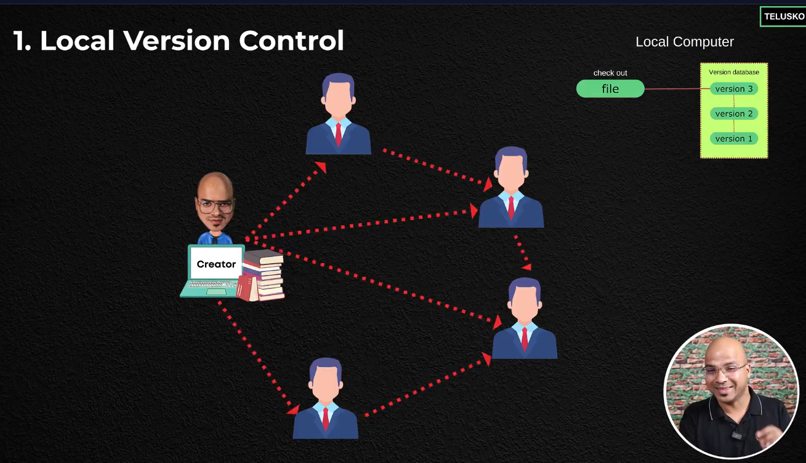
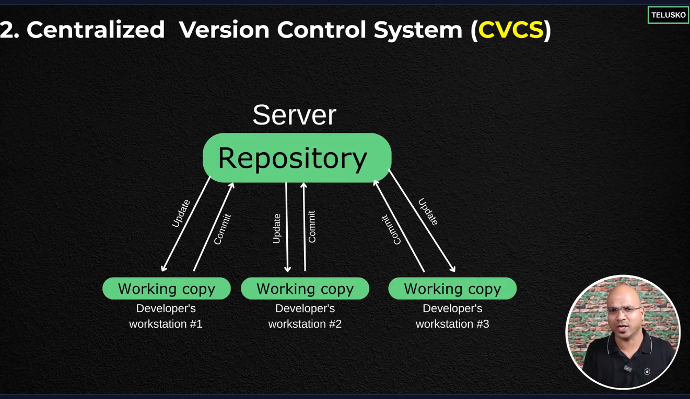
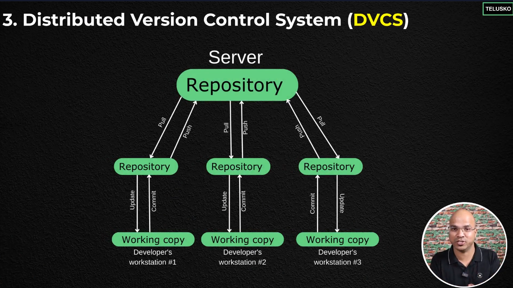
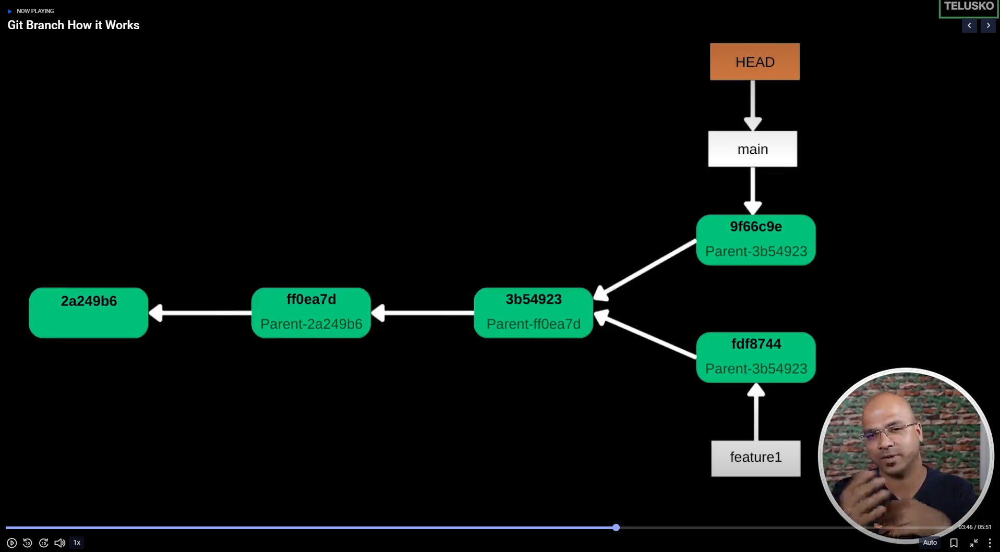

# 1. Version Control

> **Version control** is a system that records changes to files over time, allowing you to recall specific versions later. It is essential for collaboration, backup, and tracking the history of a project.

### Types of Version Control

1. **Local Version Control**

   - Stores versions on your local machine.
   - 
2. **Centralized Version Control**

   - Uses a central server to store all versions.
   - 
3. **Distributed Version Control**

   - Every user has a complete copy of the repository.
   - 

# 2. Git

### Getting Started with Git

#### How to Download and Install Git

To get started with Git, you need to download and install it on your machine:

1. Go to the official Git website: [https://git-scm.com/](https://git-scm.com/)
2. Download the installer for your operating system (Windows, macOS, or Linux).
3. Run the installer and follow the setup instructions.

**Video Guide:**

- [How to Download and Install Git (YouTube)](https://youtu.be/t2-l3WvWvqg?si=Qvh159ZHZlQ4n61L)
- After installation, configure Git with your user name and email:

  ```sh
  git config --global user.name "Your Name"
  git config --global user.email "your.email@example.com"
  ```

## History of Git :

- 2005, Linus Torvalds created Git to manage the Linux kernel development
- 2008, GitHub was founded to host Git repositories
- Today, Git is widely used for version control in software development

# 3. GitHub

> **GitHub** is a web-based platform for hosting Git repositories online. It enables collaboration, code sharing, and version control for individuals and teams. GitHub provides tools for issue tracking, code review, project management, and continuous integration.

## Why Use GitHub?

- Store your code in the cloud and access it from anywhere
- Collaborate with others on open source or private projects
- Track issues, manage pull requests, and review code
- Showcase your work and contribute to other projects

## Getting Started with GitHub

1. Create a free account at [https://github.com/](https://github.com/)
2. Create a new repository (public or private)
3. Connect your local Git repository to GitHub:
   ```sh
   git remote add origin https://github.com/your-username/your-repo.git
   git push -u origin main
   ```

## Authenticating to GitHub Using SSH

To securely connect to GitHub without entering your username and password every time, you can use SSH keys:

### Steps to Set Up SSH Authentication

1. **Generate a new SSH key pair:**

   ```sh
   ssh-keygen -o
   ```

   Press Enter to accept the default file location, and set a passphrase if desired.
2. **Add your SSH key to the ssh-agent:**

   ```sh
   eval $(ssh-agent -s)
   ssh-add ~/.ssh/id_rsa
   ```
3. **Add the public key to your GitHub account:**

   - Copy the contents of your public key to the clipboard:
     ```sh
     cat ~/.ssh/id_rsa.pub
     ```
   - Go to GitHub > Settings > SSH and GPG keys > New SSH key, and paste the key.
4. **Use the SSH URL when cloning or adding remotes:**

   ```sh
   git clone git@github.com:your-username/your-repo.git
   ```

Now you can push and pull from GitHub securely using SSH authentication.

4. Use `git push` to upload changes and `git pull` to download updates from GitHub

## Common GitHub Actions

- **Fork**: Copy someone else's repository to your account
- **Clone**: Download a repository to your local machine
- **Pull Request**: Propose changes to a repository
- **Issues**: Report bugs or request features
- **Actions**: Automate workflows (CI/CD)

**Tip:** Explore GitHub's web interface for file browsing, editing, and collaboration features.

### Git Commands

- `git init`: Initialize a new Git repository
- `git add`: Add files to the staging area
- `git commit`: Commit changes to the repository
- `git status`: Check the status of the repository
- `git log`: View the commit history
- `git diff`: Show the differences between commits
- `git diff --staged` show the differences between the staging area and the last commit
- `git rm --cached <file_name>`: Remove a file from the staging area
- `git remote -v` : Show the fetch | push URLs for the remote repository
- `git remote add origin <repository_url>`: Add a remote repository
- `git push -u origin main`: Push changes to the remote repository
- `git pull origin main`: Pull changes from the remote repository
- `git branch`: List all branches
- `git branch <branch_name>`: Create a new branch

## **Git Tags: Definition and Purpose**

**Definition:**
A **Git tag** is a reference or marker that points to a specific commit in a Git repository. Unlike branches, tags are usually **static**; they don’t move when new commits are added.

**Purpose / Why we use tags:**

* **Mark releases:** Commonly used to indicate version releases (e.g., `v1.0`, `v2.1`).
* **Easy reference:** Quickly access a specific commit without remembering its hash.
* **Deployment:** Tags can signal production-ready code.
* **Documentation:** Annotated tags can include messages and metadata for history tracking.

---

## **How to Create Tags in Git (with comments)**

### **1️⃣ List existing tags**

```bash
git tag  # Lists all tags in your repository
```

---

### **1️⃣ List an existing(including commits) tag**

```bash
git show <tag_name>  
```

---

### **2️⃣ Create a tag**

#### **a) Lightweight tag**

```bash
git tag v1.0  # Creates a simple tag pointing to the latest commit
```

#### **b) Annotated tag** (recommended)

```bash
git tag -a v1.0 -m "Release version 1.0"  
# -a : create an annotated tag  
# -m : message describing the tag  
# Annotated tags store extra information like author, date, and description
```

---

### **3️⃣ Tag a specific commit**

```bash
git tag -a v1.0 <commit-hash> -m "Release version 1.0"  
# Replace <commit-hash> with the commit ID you want to tag
# Useful if you want to tag an older commit, not just the latest one
```

---

### **4️⃣ Push tags to remote**

```bash
git push origin v1.0        # Pushes a single tag to the remote repository
git push origin --tags       # Pushes all local tags to the remote repository
```

> By default, tags are **not pushed automatically**, so you need to push them explicitly.

---

### **5️⃣ Verify pushed tags**

```bash
git ls-remote --tags origin  # Lists all tags present on the remote
```

---

💡 **Tip:**

* Use **annotated tags** for official releases because they include metadata and messages.
* Use **lightweight tags** for local bookmarks or temporary references.

## 12. Branch Management

Branches in Git allow you to diverge from the main line of development and work on features independently. Effective branch management is crucial for team collaboration and maintaining a clean project history.

### Understanding Branches


A branch in Git is simply a lightweight movable pointer to a specific commit. The default branch name in Git is `main` (or `master` in older repositories).

### Creating Branches

```bash
# Create a new branch
git branch <branch-name>

# Create a new branch and switch to it
git checkout -b <branch-name>

# Or using the newer switch command
git switch -c <branch-name>
```

### Listing Branches

```bash
# List all local branches
git branch

# List all branches (local and remote)
git branch -a

# List remote branches
git branch -r
```

### Switching Branches

```bash
# Switch to an existing branch
git checkout <branch-name>

# Or using the newer switch command (recommended)
git switch <branch-name>

# Switch to the previous branch
git switch -
```

### The Git Switch Command

The `git switch` command was introduced in Git 2.23 as a more focused alternative to `git checkout` for branch-related operations. It's designed to be more intuitive and safer:

```bash
# Switch to a branch
git switch <branch-name>

# Create and switch to a new branch
git switch -c <branch-name>

# Switch to a branch and recreate it from the specified starting point
git switch -C <branch-name> <start-point>

# Switch to a branch that doesn't exist locally but exists on a remote
git switch --track <remote>/<branch>

# Discard all local changes in your working directory
git switch --discard-changes

# Merge changes from another branch into the current branch
git switch -m <branch-name>
```

### Deleting Branches

```bash
# Delete a local branch
git branch -d <branch-name>

# Force delete a branch (even if not merged)
git branch -D <branch-name>

# Delete a remote branch
git push origin --delete <branch-name>
```

### Renaming Branches

```bash
# Rename the current branch
git branch -m <new-name>

# Rename a specific branch
git branch -m <old-name> <new-name>
```

### Merging Branches

```bash
# Switch to the target branch (e.g., main)
git switch main

# Merge changes from a feature branch
git merge <feature-branch>
```

### Rebasing Branches

```bash
# Rebase the current branch onto another branch
git rebase <base-branch>

# Interactive rebase to clean up commit history
git rebase -i <base-branch>
```

### Branching Strategies

#### Git Flow

A popular branching model:

- `main`: Production-ready code
- `develop`: Integration branch for features
- `feature/*`: Feature branches
- `release/*`: Release preparation
- `hotfix/*`: Emergency fixes

#### GitHub Flow

A simpler model:

- `main`: Always deployable
- Feature branches: Created from main for new features
- Pull requests: Used to merge features back to main

#### Trunk-Based Development

A model with short-lived branches and frequent merges to `main`:

- Developers create short-lived feature branches
- Changes are merged to `main` frequently (daily or more often)
- Releases are made from `main`

### Best Practices for Branch Management

1. **Use descriptive branch names**: `feature/user-authentication` instead of `feature-123`
2. **Keep branches focused**: Each branch should address a single feature or fix
3. **Regularly sync with the main branch**: Rebase or merge main into your feature branch to stay up-to-date
4. **Delete merged branches**: Keep your repository clean by removing branches after they're merged
5. **Use pull requests for code review**: Before merging, ensure your code is reviewed
6. **Protect important branches**: Use branch protection rules for `main` and other critical branches
7. **Resolve conflicts early**: Address merge conflicts as soon as possible
8. **Document your branching strategy**: Ensure all team members understand your workflow