# Ai Powered course  with AWS 
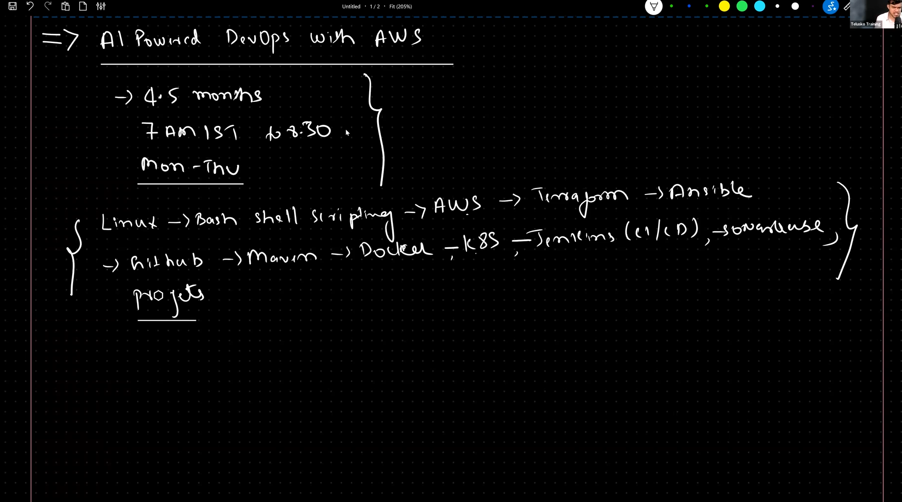

# SDLC :
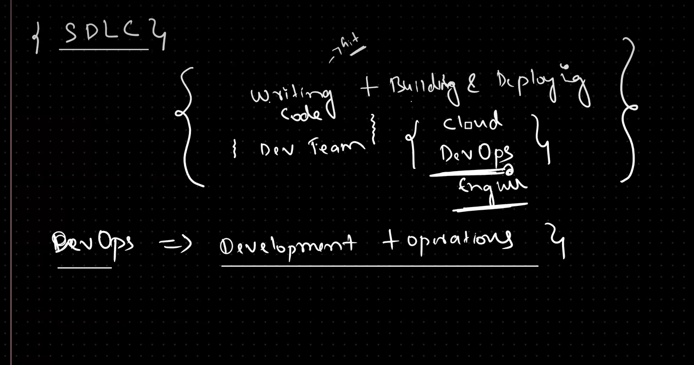

**Software Development Life Cycle (SDLC)** is a structured process used by development teams to design, develop, test, and deploy software efficiently and with high quality.

## Key Stages of SDLC

1. **Requirement Analysis**
	- Gather and analyze business needs and user requirements.
	- Define project scope and objectives.

2. **Planning**
	- Create a project plan, timeline, and resource allocation.
	- Identify risks and mitigation strategies.

3. **Design**
	- Architect the system and design software components.
	- Prepare technical specifications and UI/UX designs.

4. **Implementation (Coding)**
	- Developers write code based on design documents.
	- Follow coding standards and best practices.

5. **Testing**
	- Test the software for bugs, errors, and performance issues.
	- Conduct unit, integration, system, and acceptance testing.

6. **Deployment**
	- Release the software to production or end users.
	- Monitor deployment and resolve any issues.

7. **Maintenance**
	- Provide ongoing support, bug fixes, and updates.
	- Enhance features based on user feedback.

## SDLC Models
- **Waterfall Model:** Sequential, each stage must be completed before the next begins.
- **Agile Model:** Iterative, allows for flexibility and continuous improvement.
- **DevOps Model:** Integrates development and operations for faster delivery and automation.

> SDLC helps teams deliver reliable, maintainable, and high-quality software by following a clear process from idea to deployment and beyond.

# DevOps
-Devops main aim is to establish collaboration between
development team and operation team to deliver software faster and more reliably.

-Devops is a culture/process in IT industry to simplify application delivery process to the client with high quality

## Teams : 
### Development team roles : 
Requirement Gathering -> Requirement Analysis -> Design -> Coding -> unit testing -> code integration -> bug fixing 

### Operation team roles :

1) understand infrastructure requirement 
  - Network
  - Server  
  - Storage
  - Database
  - Security
  - Monitoring ...
2) infrastructure creation on cloud(AWS)(Terraform)
-the first way to create the infrastructure is manually      using the ui (user  interface) of the cloud provider
-the second way is using the code to create the infrastructure (Terraform)

3) Infrastructure management (Ansible)
- Ansible is a configuration management tool that helps to manage the infrastructure and automate the tasks.

4) work with linux machine (Servers)
- Linux is a popular operating system used in servers and it is open source and free to use.

5) working with source code repositories (Github)
- Github is a platform that helps to manage the source code and collaborate with other developers.

6) work with docker
- Docker is a platform that helps to package and deploy the applications in containers.

7) manage the containers (Kubernetes)
- Kubernetes is a platform that helps to manage the containers and automate the tasks.

8) Automate build and deployment CI/CD pipeline (Jenkins)
- Jenkins is a platform that helps to automate the build, test, and deployment process.

9) Monitoring and logging (Prometheus, Grafana)

### Skills required for DevOps :
- SDLC (software development life cycle)
- waterfall model
- agile model (scrum framework)
- application architecture (front-end , back-end,tech    
  stack , database)
- linux OS (commands, shell scripting)
- shell scripting 
- cloud computing
- Devops tools : 
  - Terraform
  - Ansible
  - Maven
  - Git and github
  - Tomcat
  - Docker
  - K8S
  - Jenkins
  - Prometheus & Grafana
  - EFK/ELK (App Log monitoring)
  - SonarQube

build, test deliver the software  app within set of time & budget 
languages (c, Cpp , java ,python ..)

## Software Project

> A software project is a planned effort to create or improve a software application that simplifies or enhances human life. It involves a team working together to design, build, test, and deliver the software within a set timeframe and budget.

To develop any software, we use programming languages such as C, C++, Java, Python, etc.

### Examples
- Amazon
- Facebook
- Instagram

### Types of Software Projects

1. **Standalone/Desktop Application**
   - Designed for a single user on a local device
   - Examples: Notepad, Operating System, Calculator, Paint

2. **Web Application**
   - Requires an internet connection and a browser
   - Can be accessed by multiple users simultaneously
   - Examples: Facebook, Amazon, Instagram

3. **Distributed Application (Web Services, REST API)**
   - Applications communicate with other applications to reuse business logic
   - Example: AliExpress uses PayPal as a third-party payment provider

4. **Mobile Application**
   - Apps designed to run on mobile devices
   - Can be web apps or standalone apps

## Application architecture  : 
1 - front-end (ui | presentation layer) 
2- back-end (business logic)
3- data base (data storage)
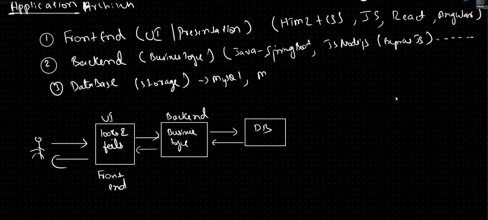
### Monolithic vs microservices : 
- the monolithic architecture is a single application that contains all the components of the application in a single codebase.

- the microservices architecture is a set of small services that each service has its own codebase and database.
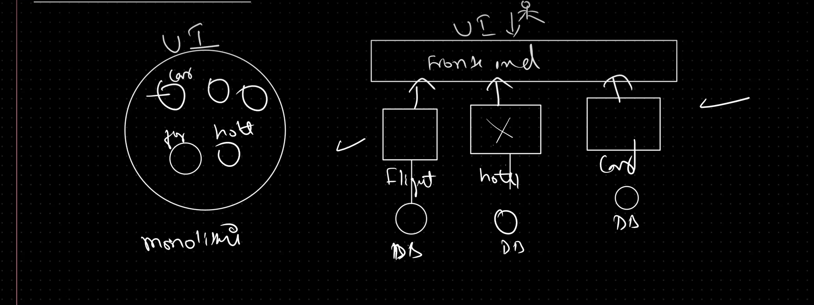
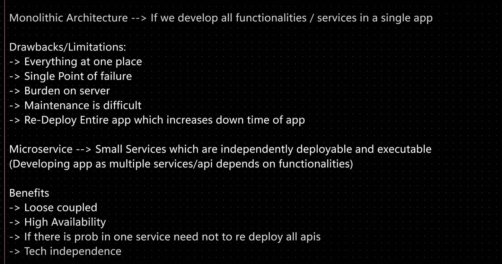

## SDLC (software development life cycle) :
- SDLC is a process that defines the steps to develop a software application from the initial idea to the final delivery to the client.

- SDLC is a process that defines the steps to develop a software application from the initial idea to the final delivery to the client.

- SDLC is a process that defines the steps to develop a software application from the initial idea to the final delivery to the client.
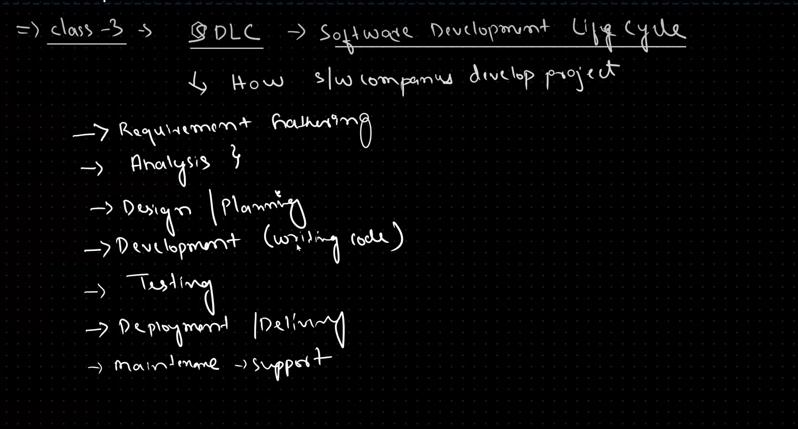

### Types of SDLC : 
1- waterfall model
2- agile model (scrum framework)
3- spiral model
4- V model
5- iterative model
6- prototyping model    

### Waterfall model : 
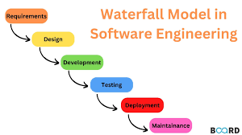
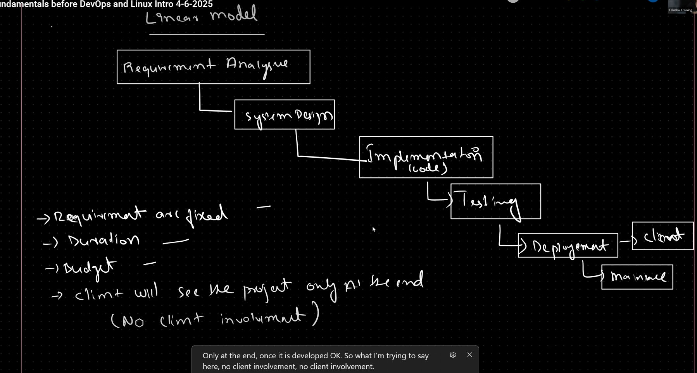
The **Waterfall Model** is one of the **oldest and most traditional software development life cycle (SDLC)** models. It follows a **linear and sequential approach**, where each phase must be completed before moving to the next.

---

### 💧 Definition

The **Waterfall Model** is called “waterfall” because the process flows **downward through distinct phases** — like a waterfall — and **once you finish one phase, you don’t go back**.

---

### 🧩 Phases of the Waterfall Model

1. **Requirement Analysis**

   * Collect and document all the system requirements.
   * Example: Understanding what features the client wants.

2. **System Design**

   * Create system architecture, database design, and data flow diagrams.
   * Example: Designing the structure of the app (UI, database schema).

3. **Implementation (Coding)**

   * Developers write the actual code based on design documents.

4. **Integration & Testing**

   * Combine all modules and test the system for errors or bugs.

5. **Deployment**

   * Deliver the product to the client or deploy it to production.

6. **Maintenance**

   * Fix bugs, update the system, or make improvements after delivery.

---

### ⚙️ Characteristics

* **Sequential:** Each phase depends on the deliverables of the previous one.
* **Rigid:** You can’t move back to a previous phase easily.
* **Documentation-heavy:** Every step requires detailed documentation.

- the waterfall model is a sequential model that defines the steps to develop a software application from the initial idea to the final delivery to the client.

### Agile model (scrum framework) :
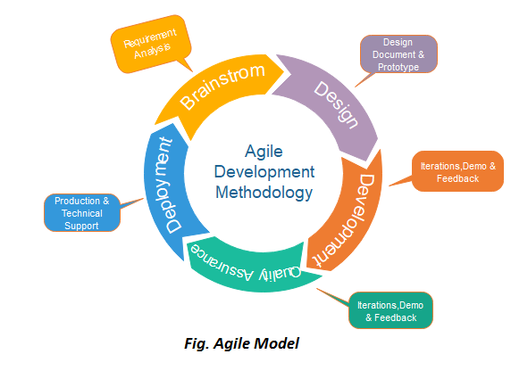
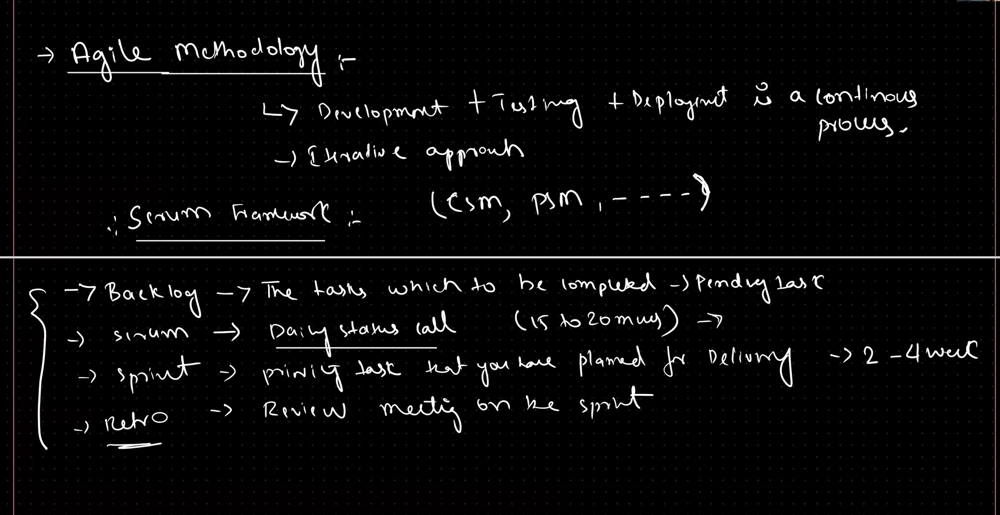
## 🚀 **Agile Model**

### 💡 Definition

**Agile** is a **flexible, iterative** approach to software development.
Instead of building the whole project at once (like in Waterfall), Agile breaks it into **small parts** called **iterations** or **sprints** — each one delivers a **working piece of software**.

In simple terms:
➡️ *“Build small, test fast, improve often.”*

---

### 🔁 **Core Idea**

Agile focuses on:

* **Continuous feedback**
* **Team collaboration**
* **Customer involvement**
* **Adapting to change quickly**

---

### ⚙️ **Agile Development Cycle**

1. **Planning**

   * Define project goals and prioritize features (called *user stories*).

2. **Design**

   * Design the functionality for the current sprint.

3. **Development**

   * Developers code the selected features.

4. **Testing**

   * Test immediately within the same sprint.

5. **Review / Demo**

   * Present the new feature to stakeholders and collect feedback.

6. **Retrospective**

   * The team discusses what went well and what can be improved.

7. **Repeat**

   * Next sprint starts, using lessons learned and feedback.

Each sprint usually lasts **1–4 weeks**, producing a **usable version of the product** every time.

---

### 🧠 **Agile Frameworks**

Agile is a philosophy — there are several **frameworks** that follow it:

* **Scrum** 🌀 (most popular — uses sprints and daily stand-ups)
* **Kanban** 📋 (visual task board with continuous flow)
* **Extreme Programming (XP)** ⚡ (focus on technical excellence)
* **Lean** 🧩 (minimize waste, maximize value)

---

### ✅ **Advantages**

* Highly **flexible** — easy to adapt to changing requirements.
* Early and **frequent delivery** of working software.
* Encourages **customer feedback** throughout development.
* **Continuous testing** = better quality.
* Improves **team collaboration** and motivation.

---

### ❌ **Disadvantages**

* Requires **experienced, disciplined teams**.
* Harder to predict final cost and timeline.
* Needs **constant client involvement**.
* Documentation may be lighter (harder for long-term maintenance).

---

### ⚖️ **Waterfall vs Agile Comparison**

| Aspect                   | **Waterfall**               | **Agile**                  |
| ------------------------ | --------------------------- | -------------------------- |
| **Approach**             | Sequential                  | Iterative & incremental    |
| **Flexibility**          | Rigid                       | Adaptive                   |
| **Testing**              | After coding                | Continuous                 |
| **Customer Involvement** | Only at start & end         | Ongoing                    |
| **Delivery**             | One final product           | Frequent small releases    |
| **Risk Management**      | High (late issues)          | Low (early detection)      |
| **Best For**             | Fixed-scope, small projects | Dynamic, evolving projects |

---

### 🧩 **Example**

Let’s say you’re building a **shopping app**:

* In **Waterfall**, you’d design, code, and test the entire app, then release it all at once.
* In **Agile**, you might first build **user login** in Sprint 1, **product listing** in Sprint 2, and **checkout system** in Sprint 3 — testing and improving as you go.

# infrastructure : 

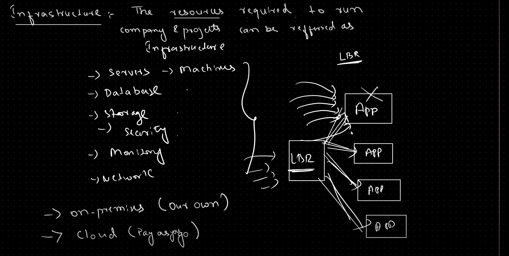

## Infrastructure

Infrastructure is the set of physical and virtual resources required to run software systems: servers, networks, storage, databases, and related components. In modern IT there are two primary deployment models:

### 1. On-Premises Infrastructure
- Definition: Hardware and software resources that are owned, hosted, and managed within an organization’s physical premises (data centers or server rooms).
- Characteristics:
   - Full control over hardware and security
   - Higher upfront capital expenditure (CapEx)
   - Requires in-house operations and maintenance (power, cooling, hardware refresh)
   - Longer procurement cycles
   - Suitable for workloads with strict compliance, latency, or data residency requirements

### 2. Cloud Infrastructure
- Definition: Virtualized infrastructure provided by cloud providers (AWS, Azure, GCP) and delivered over the internet as services (IaaS, PaaS, SaaS).
- Characteristics:
   - Pay-as-you-go operational expenditure (OpEx)
   - Rapid provisioning and scaling
   - Managed services (databases, monitoring, identity)
   - Global availability and redundancy
   - Shifts responsibility for hardware maintenance to the cloud provider

### On-Premises vs Cloud — Comparison

- **Cost model:** On-premises uses CapEx (buy hardware), Cloud uses OpEx (pay per use).
- **Control:** On-premises gives full control; Cloud abstracts hardware management.
- **Scalability:** Cloud supports near-instant scaling; on-premises scaling requires procurement and setup.
- **Availability & Redundancy:** Cloud providers offer built-in multi-region availability; on-premises must be engineered manually.
- **Compliance & Data Residency:** On-premises can be easier to certify for strict regulations; cloud offers compliance programs but still requires configuration.
- **Operational Overhead:** On-premises requires in-house ops team; cloud reduces hardware maintenance overhead.

### When to Choose Which
- Choose **On-Premises** when you need absolute control, have very predictable workloads, or have strict regulatory requirements.
- Choose **Cloud** when you need agility, variable workloads, global reach, or want to reduce time-to-market and operational burden.

## Autoscaling

Autoscaling is the ability to automatically adjust compute capacity to match application demand. It helps maintain performance while optimizing cost.

### Types of Autoscaling
- **Vertical Scaling (Scale Up / Scale Down):** Increase or decrease the size (CPU, RAM) of a single server or instance.
   - Pros: Simple; no need to change application architecture.
   - Cons: Limited by instance sizes; may cause downtime when resizing.

- **Horizontal Scaling (Scale Out / Scale In):** Add or remove instances to distribute load across multiple servers.
   - Pros: Better fault tolerance, easier to scale beyond single-machine limits.
   - Cons: Requires stateless application design or session management (e.g., sticky sessions or shared stores).

### Autoscaling in the Cloud (Example: AWS)
- **AWS Auto Scaling / EC2 Auto Scaling:** Automatically adjusts the number of EC2 instances in an Auto Scaling group based on policies, schedules, or target tracking (e.g., CPU utilization).
- **Kubernetes Horizontal Pod Autoscaler (HPA):** Scales the number of pods in a deployment based on CPU/memory usage or custom metrics.
- **Serverless Scaling:** Services like AWS Lambda automatically scale the number of function instances based on incoming events.

### Autoscaling Best Practices
- Design applications to be stateless or use external state stores (databases, caches) so instances can be added/removed safely.
- Use health checks and graceful shutdown to avoid traffic being sent to unhealthy instances.
- Combine horizontal and vertical scaling where appropriate (e.g., scale out first, then scale up if needed).
- Use predictive/schedule-based scaling for known traffic patterns (e.g., peak hours).
- Monitor scaling events and costs; set sensible thresholds to avoid oscillation (thrashing).

## Infrastructure as Code (IaC)

IaC tools (Terraform, CloudFormation) let you define infrastructure declaratively in version-controlled files. Benefits include reproducibility, reviewable changes, and automation.

### IaC Best Practices
- Keep infrastructure code in the same VCS as application code when appropriate.
- Use modules and parameterization for reusable components.
- Protect state files (encrypt and use remote backends like S3 with locking via DynamoDB for Terraform).
- Review and test IaC changes (plan/apply) via CI pipelines.

---

## Fundamentals of Programming:
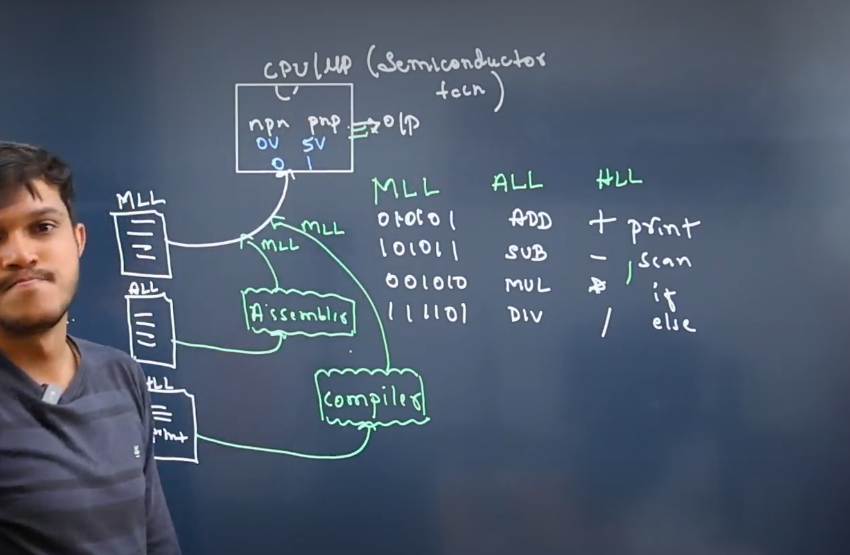

### Computer Architecture
- **CPU (Central Processing Unit)** - The main processor that executes instructions
  - Semiconductor-based hardware
  - Contains arithmetic logic unit (ALU) and control unit
  - Executes machine code at the hardware level

### Programming Languages Hierarchy
1. **Machine Language**
   - Binary code (0s and 1s) directly understood by CPU
   - Lowest level of programming

2. **Assembly Language**
   - Mnemonic codes representing machine instructions
   - Converted to machine code by assemblers
   - Example: ADD, MOV, JMP instructions
   - Provides hardware-level control

3. **High-Level Languages**
   - More readable and abstract from hardware
   - Converted to assembly language by compilers/interpreters
   - Examples:
     - C
     - C++
     - Java
     - Python
     - JavaScript

### Machine Learning (ML) Languages
- Specialized languages and libraries for ML development
- Python with frameworks (TensorFlow, PyTorch)
- R for statistical computing
- Julia for high-performance numerical computing
- Domain-specific languages for neural networks

### Language Translation Process
1. High-level source code
2. Compiler/Interpreter converts to assembly
3. Assembler converts assembly to machine code
4. CPU executes machine code

### Programming Concepts
- Variables and data types
- Control structures (loops, conditionals)
- Functions and procedures
- Object-oriented programming
- Memory management

 

 

     

