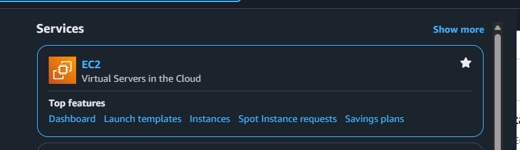
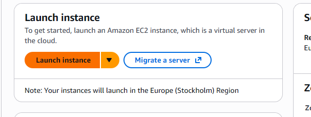
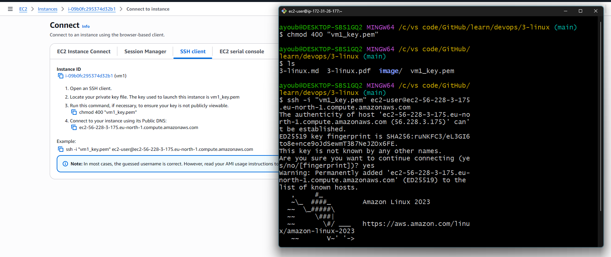
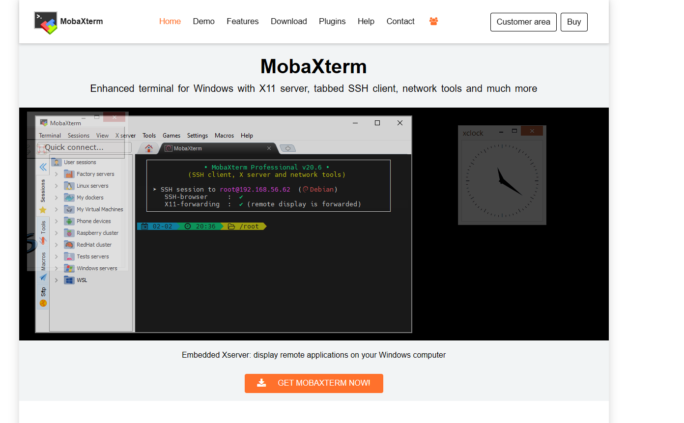
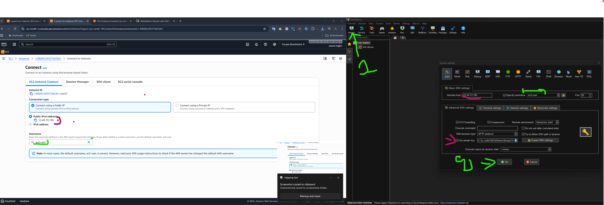
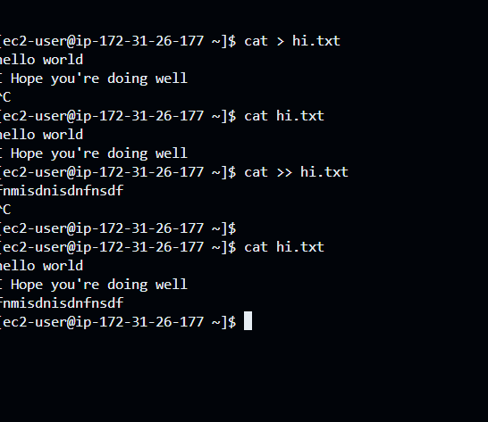
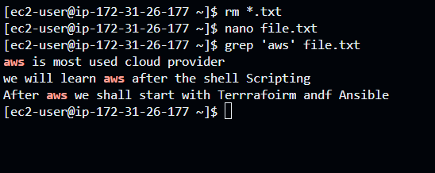
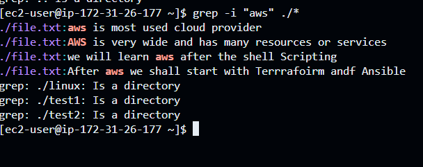

# Introduction to Linux
Linux is a powerful and versatile open-source operating system kernel. It serves as the foundation for a wide variety of operating systems, known as Linux distributions (or distros), such as Ubuntu, Fedora, and Debian. Originally created by Linus Torvalds in 1991, Linux has grown through the contributions of a massive global community. It is renowned for its stability, security, and flexibility, making it a popular choice for everything from web servers and supercomputers to desktops and mobile devices.

### what's an operating system?
An operating system (OS) is a software that manages computer hardware and software resources. It acts as an intermediary between the user and the computer hardware, providing a user interface and services to run applications and manage data. Operating systems can be categorized into different types based on their architecture, functionality, and use cases. Some common types of operating systems include:
- **Windows**: Developed by Microsoft, Windows is a popular operating system for desktops and laptops. It offers a graphical user interface (GUI) and supports a wide range of applications.
    - support user based os 
    -  paid 
    - less security feature compare to linux 
    - windows is more preferred for personal usage 

- **macOS**: Developed by Apple, macOS is a proprietary operating system for Apple's Macintosh computers. It is known for its sleek design, ease of use, and integration with other Apple products.
- **Linux**: An open-source operating system kernel, Linux serves as the foundation for various Linux distributions. It is known for its stability, security, and flexibility, making it popular for servers, supercomputers, and embedded systems.
- **Android**: Developed by Google, Android is a mobile operating system based on the Linux kernel. It is widely used on smartphones and tablets, offering a customizable user interface and access to a vast ecosystem of applications.
- **iOS**: Developed by Apple, iOS is a mobile operating system for Apple's iPhone and iPad devices. It is known for its user-friendly interface, seamless integration with other Apple products, and robust security features.

### Linux Distributions
Linux distributions, also known as distros, are different versions of the Linux operating system that come with a range of pre-installed software and tools. Some popular Linux distributions include: 
- **Ubuntu**: A popular and user-friendly Linux distribution based on Debian. It is widely used for desktops and servers.
- **Fedora**: A community-driven Linux distribution sponsored by Red Hat. It is known for its cutting-edge features and rapid updates.
- **Debian**: A stable and versatile Linux distribution that is widely used for servers and desktops.  and others ... 


### **GUI vs CLI**
A graphical user interface (GUI) is a user interface that allows users to interact with electronic devices through graphical icons and visual indicators such as menus, windows, and buttons. It provides a visual representation of the underlying software and hardware, making it easier for users to navigate and perform tasks.

# what we will learn in linux : 
- file base operations 
- text editors 
- text filters 
- users management 
- file permission 
- file ownership
= archives
- networking
- sudo files 
- sshd_config 
- package managers 
- static website hosting (httpd)
- linux architecture
- shell scripting 

## Steps : 
- create an account on aws (free trial)
- login with your aws account 
- aws ec2 service to create a linux virtual machine 
- connect to your linux virtual machine  using  : 
MobaXterm is a comprehensive remote access tool for Windows that is frequently used to connect to Amazon Web Services (AWS) EC2 instances. It provides a robust SSH client, alongside other functionalities like an X11 server, SFTP client, and various network tools, simplifying remote system management and file transfers.


## Steps application : 

1. search for the ec2 after you created your account in aws : 

 -- added the ec2 to the favorites : 
 

 -- access the ec2 : 


-- create a new ec2 instance : 


---

## 🧩 **Overview of EC2 Instance Creation**

When you create an EC2 instance (a virtual server) on AWS, you configure several attributes that define:

* **What** OS and software it runs (AMI)
* **How powerful** it is (instance type)
* **How you access** it (key pair & network)
* **How secure** it is (security group)
* **How it stores data** (storage volumes)

Let’s detail each section.

---

## 1️⃣ **Name and Tags**

### ➤ Name

* **Example:** `majjid`
* **Purpose:** A human-readable identifier for your instance.
* **Impact:** Used in the AWS console to easily identify your instance.
* **Best practice:** Use clear, structured naming (e.g., `project-env-role`: `erp-prod-api`).

### ➤ Tags

* **Purpose:** Key-value pairs that organize and categorize AWS resources.
* **Example:**

  * Key: `Environment` | Value: `Production`
  * Key: `Owner` | Value: `Ayoub Majjid`
* **Best practice:** Always tag for cost tracking, automation, and organization.

---

## 2️⃣ **Application and OS Images (AMI)**

### ➤ AMI (Amazon Machine Image)

* **What it is:** A pre-configured image that includes:

  * Operating system (e.g., Amazon Linux, Ubuntu, Windows)
  * Optional software (e.g., Nginx, MySQL)
* **Example:**
  `Amazon Linux 2023 kernel-6.1 AMI`
  AMI ID: `ami-0aa78f446b4499266`
* **Architecture:**

  * `x86` for Intel/AMD
  * `Arm` for Graviton processors (cheaper, more efficient)
* **Boot mode:** `uefi-preferred` (modern BIOS standard)
* **Root device type:** `EBS` → Uses Elastic Block Store for persistent storage.
* **Username:** Usually `ec2-user` or `ubuntu` (used for SSH login).
* **Best practice:** Choose AMIs from verified providers (AWS or trusted vendors).

---

## 3️⃣ **Instance Type**

### ➤ Example: `t3.micro`

* **Defines the hardware resources**:

  * vCPU: Virtual CPUs (2 here)
  * Memory: 1 GiB RAM
  * Family: `t3` = burstable general-purpose instances
* **Categories:**

  * `t`, `m`: general-purpose
  * `c`: compute-optimized
  * `r`: memory-optimized
  * `p`, `g`: GPU-based (for AI/ML)
* **Free tier eligible:** t2.micro / t3.micro for 750 hours/month.
* **Pricing:** Pay per hour (on-demand) or reserve for cheaper rates.
* **Best practice:** Start with `t3.micro` for testing, scale up later.

---

## 4️⃣ **Key Pair (Login)**

### ➤ Example: `myKey`

* **Purpose:** Secure SSH authentication (no password login).
* **How it works:**

  * AWS keeps the public key.
  * You download the private key (`.pem` file).
* **Used for:** Connecting via SSH (Linux) or RDP (Windows).
* **Best practice:**

  * Never lose your key file — AWS cannot recover it.
  * Store it securely (e.g., in AWS Secrets Manager or locally with restricted permissions).

---

## 5️⃣ **Network Settings**

### ➤ Network (VPC)

* **Example:** `vpc-05d99f548718f027e`
* **Purpose:** Defines the private network your instance lives in.
* **Each VPC contains:** Subnets, route tables, and security configurations.
* **Best practice:** Use a VPC per environment (e.g., dev, prod).

### ➤ Subnet

* **Purpose:** Defines which **availability zone** (data center) the instance runs in.
* **“No preference”** lets AWS choose automatically.
* **Best practice:** Place instances near dependent resources (databases, load balancers).

### ➤ Auto-assign Public IP

* **Enable:** Assigns a public IP so you can connect via the Internet.
* **Disable:** Instance is private (used for internal servers).
* **Best practice:** Enable only for publicly accessible services or development.

---

## 6️⃣ **Firewall (Security Groups)**

### ➤ Security Group

* **Purpose:** A virtual firewall controlling inbound and outbound traffic.
* **Rules example:**

  * Allow SSH (port 22) from anywhere → `0.0.0.0/0`
  * Allow HTTP (port 80) from anywhere
  * Allow HTTPS (port 443) from anywhere
* **Best practice:**

  * Restrict SSH to your IP only.
  * Use HTTPS for web traffic.
  * Avoid open rules (`0.0.0.0/0`) unless absolutely needed.

---

## 7️⃣ **Configure Storage**

### ➤ Example:

| Type | Size  | Volume | IOPS | Encryption    |
| ---- | ----- | ------ | ---- | ------------- |
| Root | 8 GiB | gp3    | 3000 | Not encrypted |

* **Root volume:** The disk where the OS is installed.
* **Type:**

  * `gp3` (default) = General-purpose SSD (balance of price/performance)
  * `io2` = High-performance SSD (for databases)
* **IOPS:** Input/Output operations per second (3000 default = fine for small workloads)
* **Encryption:** Protects data at rest.
* **Best practice:**

  * Use encryption in production.
  * Increase size if installing large software or storing files.

---

## 8️⃣ **Advanced Details**

### ➤ Number of Instances

* **Default:** 1
* **Purpose:** You can launch multiple instances with the same settings.

### ➤ User Data (optional)

* **Purpose:** Run scripts automatically at launch.
* **Example:** Install software or configure environment:

  ```bash
  #!/bin/bash
  sudo yum update -y
  sudo yum install nginx -y
  sudo systemctl start nginx
  ```
* **Best practice:** Use this for bootstrapping (DevOps automation).

---

## 9️⃣ **Summary Section**

This gives a final recap:

| Category       | Example           |
| -------------- | ----------------- |
| AMI            | Amazon Linux 2023 |
| Instance Type  | t3.micro          |
| Security Group | launch-wizard-1   |
| Storage        | 8 GiB gp3         |
| Count          | 1                 |
| Key Pair       | myKey             |

Click **Launch Instance** to create and deploy.

---

## 🔐 **Post-Launch Steps**

1. **Access instance:**

   ```bash
   ssh -i myKey.pem ec2-user@<public-ip>
   ```
2. **Secure configuration:**

   * Change SSH access to your IP.
   * Enable automatic updates.
3. **Create Elastic IP** (optional) for a permanent IP address.
4. **Monitor usage** in CloudWatch to track CPU, memory, and network.

---

## ⚙️ **In Summary**

| Attribute      | Description        | Best Practice                 |
| -------------- | ------------------ | ----------------------------- |
| Name & Tags    | Identification     | Add `Owner`, `Env`, `Project` |
| AMI            | OS + base software | Choose verified AMI           |
| Instance Type  | Hardware capacity  | Start small, scale up         |
| Key Pair       | SSH login          | Keep private key secure       |
| Network        | VPC + subnet       | Use custom VPC for production |
| Security Group | Firewall rules     | Restrict access               |
| Storage        | Disk               | Encrypt & right-size          |
| Advanced       | Scripts, count     | Automate with user data       |

## Connect to EC2 VM using SSH

1.  **Place your key file:** Put the `vm1_key.pem` file in a directory on your local machine.

2.  **Open a terminal:** Open a terminal (like Git Bash on Windows) in the same directory where you placed the `.pem` file.

3.  **Set file permissions:** Run the following command to ensure your key is not publicly viewable. This is a required step for SSH.
    ```bash
    chmod 400 vm1_key.pem
    ```

4.  **Connect to the instance:** Use the `ssh` command with your key file (`-i`), the appropriate username for your instance (e.g., `ubuntu` or `ec2-user`), and the instance's public DNS.

    ```bash
    ssh -i "vm1_key.pem" ubuntu@ec2-56-228-3-175.eu-north-1.compute.amazonaws.com
    ```

    *   **`ssh -i "vm1_key.pem"`**: Specifies the identity file (your private key) to use for authentication.
    *   **`ubuntu@...`**: The username for the remote machine. This depends on the Amazon Machine Image (AMI) you used. Common usernames are `ubuntu` (for Ubuntu), `ec2-user` (for Amazon Linux), `fedora` (for Fedora).
    *   **`ec2-56-228-3-175.eu-north-1.compute.amazonaws.com`**: The public DNS of your EC2 instance.



## connect with mobaXterm software just for windows: 
1- download  the software : 
[link](https://mobaxterm.mobatek.net/download-home-edition.html)


2- open the software create a new session 
- put the host name as the : Public PIv4 in the provider 
- put the username as <ec2_name>
- put the private key as the path of the private key file



## linux file system && Essential commands : 
- Everything in Linux is a file
- **File system hierarchy:** The structure of directories and files.
- **Common directories:**

  * `/` = Root directory
  * `/home` = User directories
  * `/etc` = System configuration files
  * `/var` = Variable data (logs, databases)
  * `/tmp` = Temporary files
- **File Types:**:
  * `-` = Regular file
  * `d` = Directory
  * `l` = link file
  

- **Essential commands:**

  * `clear` = Clear the terminal screen
  * `ls` = List files and directories 
         - `-l` : list details (permissions, size, date)
         - `-t` : sort my modification time 
         - `-r` : reverse the sort order
         - `-a` : show hidden files
  * `cd` <path> = Change directory
            - `cd ..` : Go up one directory
            - `cd ~` : Go to the home directory
            -  `cd -` : Go back to the previous directory
            - `cd /` : Go to the root directory
  * `pwd` = Print working directory
  * `mkdir`<dirname> = Make directory
  * `rm` <filename> = Remove file 
            `rm` -r <dirname> = Remove directory and its contents
            ```rm` -f <filename> = Force remove file (no confirmation)
  * `cp` <src> <dest> = Copy file or directory
  * `whoami` = Get the current user
  * `rmdir` <dirName> = Remove empty directory
  * `touch` <filename>  = Create an empty file
  # search annotations 

## Metacharacters in Linux

Metacharacters are special characters that have a specific meaning to the shell. They are used for file matching, redirection, piping, and more.

### File Matching (Wildcards)

*   `*`: Matches zero or more characters.
*   `?`: Matches any single character.
*   `[]`: Matches any one of the enclosed characters.

### Redirection

*   `>`: Redirects standard output to a file, overwriting the file if it exists.
*   `>>`: Appends standard output to a file.
*   `<`: Redirects standard input from a file.
*   `2>`: Redirects standard error to a file.
*   `&>`: Redirects both standard output and standard error to a file.

### Piping

*   `|`: Sends the output of one command as input to another command.

### Command Separation

*   `;`: Separates multiple commands on a single line.
*   `&&`: Executes the second command only if the first command succeeds.
*   `||`: Executes the second command only if the first command fails.

### Background Execution

*   `&`: Runs a command in the background.

### Quoting

*   `\` (Backslash): Escapes the next character, treating it as a literal character.
*   `''` (Single Quotes): Treats every character literally.
*   `""` (Double Quotes): Allows variable and command substitution.


*mv <oldFileName> <new file name>* : rename a file or directory

*mv <oldFileName> <path>* : move a file to a new location

*cat <fileName>* : print the content of a file 
*cat > <filename>  * : put the content in a file  (the file optionally can not be exist before) [note : press ctrl + d to end the input]
***cat >> <filename>  * : append the content in a file  (the file optionally can not be exist before)

*Example* : 


** cat -n <filename> * : show the content of the file including the line number**

**rev <filename> ** : show the content of the file in reverse   
                      alphabetical order

**tac <filename> ** : show the content of the file from bottom to top
**cp <filename> <newFileName>** : copy a file to a new file
**cp <file1Name> <file2Name> > <newFileName>** : copy the content of two files to a new file

*cp -r <dirName> <newDirName>** : copy a directory to a new directory

*head -n <numberOfLines> <fileName> : show the first <numberOfLines> lines of a file [ if n is negative it will show the all lines except the last n lines]

*tail -n <numberOfLines> <fileName> : show the last <numberOfLines> lines of a file[ if n is negative it will show the all lines except the first n lines]


** history ** :  display the history of commands that has been written in the linux machine 

## Grep Command : 
grep is a powerful command-line utility used to search for patterns in text files. It can be used to search for specific text strings, regular expressions, or patterns within files or directories.

### Syntax

```bash
grep [options] pattern [file...]
```

### Options

* `-i`: Ignore case distinctions.
* `-v`: Invert match, i.e., select non-matching lines.
* `-r`: Recursively search directories.
* `-l`: List filenames where matches are found.
* `-n`: Prefix each line of output with the line number within its file.
* `-c`: Print a count of matching lines per
* `-w`: Match the pattern as a whole word.
* `-E`: Interpret the pattern as a regular expression.

### Examples

* `grep "pattern" file.txt`: Search for the pattern "pattern" in file.txt.
* `grep -i "pattern" file.txt`: Search for the pattern "pattern" in file.txt, ignoring case.
* `grep -v "pattern" file.txt`: Search for lines that do not contain the pattern "pattern" in file.txt.
* `grep -r "pattern" directory/`: Recursively search for the pattern "pattern" in all files within the directory.

# example  : 



- search for all 'aws' keyword in the current dir : 

