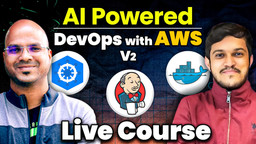

## 📌 Extracted Course Content

**📋 Course Overview**

* Duration: **4.5 months** (May 29th, 2025 → mid-October 2025)
* Schedule: **Mon–Thu, 7 AM – 8:30 AM IST** (online, live interactive sessions)
* Recordings: **Lifetime access**
* Focus: DevOps, AWS Cloud, and AI-assisted automation with tools like ChatGPT, GitHub Copilot.
* Goal: Master  **CI/CD pipelines, cloud automation, and AI-powered productivity** .

* Source :   [link](https://courses.telusko.com/learn/home/AI-Powered-DevOps-with-AWS-Live-Course)

---

**💡 Key Concepts & Tools**

* Linux OS & Shell Scripting
* AWS (EC2, S3, RDS, Lambda, EKS, IAM, VPC, CloudFormation, CloudWatch, Route 53)
* Git & GitHub (Version Control)
* Docker (Containerization)
* Kubernetes (Orchestration)
* Jenkins (CI/CD)
* Ansible (Configuration Management)
* Terraform (Infrastructure as Code)
* SonarQube (Code Quality)
* Prompt Engineering & AI-powered DevOps (ChatGPT, Copilot, Notion AI)

---

**📚 Modules Breakdown**

1. **Intro to DevOps**
   * SDLC, Monolith vs Microservices, DevOps culture
   * AI tools: ChatGPT & Notion AI for documentation
2. **Linux + Scripting + AI for Automation**
   * Linux basics, Bash scripting
   * Use AI to generate/refactor shell scripts
3. **AWS Cloud + AI for Cloud Automation**
   * EC2, S3, RDS, IAM, VPC, Lambda, CloudFormation, CloudWatch
   * Use ChatGPT for IAM policies, CLI commands, Lambda code
4. **DevOps Tools Part 1**
   * Git & GitHub (branching, merges, workflows)
   * Ansible (playbooks, roles, vault)
   * Terraform (HCL, modules, state management)
   * AI: Generate configs, troubleshoot errors
5. **DevOps Tools Part 2**
   * Docker (images, Dockerfiles, Compose, Swarm)
   * Kubernetes (deployments, autoscaling, Helm, monitoring)
   * Jenkins (pipelines, plugins, CI/CD automation)
   * SonarQube for code quality
   * AI: Generate YAML, Jenkinsfiles, debug pipelines
6. **Projects & Interview Prep**
   * End-to-end real-world DevOps projects
   * Documentation with Notion AI
   * Interview prep using ChatGPT (mock Q&A, STAR answers, resume tips)

---

**🎯 Outcomes (By the End of the Course)**

* Build & manage **production-grade CI/CD pipelines**
* Deploy and automate **AWS cloud infrastructure**
* Leverage **AI for scripting, debugging, and documentation**
* Be **job-ready for DevOps / SRE / Cloud Engineer roles**

---

## ✨ Summary

This **4.5-month online DevOps course (starting May 29, 2025)** trains you in  **AWS Cloud, modern DevOps tools, and AI-powered workflows** .

It covers  **Linux, AWS, Git/GitHub, Docker, Kubernetes, Jenkins, Ansible, Terraform, SonarQube** , plus  **AI-assisted scripting, automation, and documentation** .

You’ll work on  **hands-on projects** , build  **real CI/CD pipelines** , and use AI tools like **ChatGPT, GitHub Copilot, and Notion AI** to accelerate learning.

By the end, you’ll be ready for **DevOps, SRE, or Cloud Engineer roles** in companies adopting  **AI + DevOps practices** .

# devops with AWS : 

